# Pact Conference Demo - 아키텍처 문서

> "Mastering API Architecture" (James Gough, Daniel Bryant, Matthew Auburn) 기반 학습 프로젝트
> Consumer-Driven Contract (CDC) 테스트 실습 데모 — Phase 1~4 전체 커버리지

---

## 목차

1. [프로젝트 개요](#1-프로젝트-개요)
2. [시스템 아키텍처](#2-시스템-아키텍처)
3. [기술 스택](#3-기술-스택)
4. [API Gateway 아키텍처](#4-api-gateway-아키텍처)
5. [보안 아키텍처](#5-보안-아키텍처)
6. [API 설계](#6-api-설계)
7. [데이터 저장소 아키텍처](#7-데이터-저장소-아키텍처)
8. [테스트 아키텍처](#8-테스트-아키텍처)
9. [관찰가능성 (Observability)](#9-관찰가능성-observability)
10. [인프라 아키텍처](#10-인프라-아키텍처)
11. [클라우드 마이그레이션 전략](#11-클라우드-마이그레이션-전략)
12. [아키텍처 결정 기록 (ADR)](#12-아키텍처-결정-기록-adr)
13. [Phase별 구현 이력](#13-phase별-구현-이력)

---

## 1. 프로젝트 개요

### 1.1 프로젝트 목적

이 프로젝트는 **"Mastering API Architecture"** 책의 핵심 개념을 실습하기 위한 컨퍼런스 관리 시스템 데모입니다.

| 항목 | 내용 |
|------|------|
| 원서 | Mastering API Architecture (O'Reilly, 2023) |
| 저자 | James Gough, Daniel Bryant, Matthew Auburn |
| 도메인 | 컨퍼런스 관리 (세션, 참석자, 발표 제안) |
| 핵심 실습 | Consumer-Driven Contract (CDC) 테스트 전 흐름 |

### 1.2 책 커버리지 진행

| Phase | 범위 | 커버리지 |
|-------|------|---------|
| Phase 1 | CDC 테스트 / 테스트 피라미드 | ~11% → ~25% |
| Phase 2 | API Gateway / 보안 / OpenAPI | ~25% → ~50% |
| Phase 3 | Feature Flag / DDD / Observability | ~50% → ~65% |
| Phase 4 | API Versioning / K8s / 성능 테스트 | ~65% → ~70%+ |

- **Phase 1 완료**: 책의 ~11% → ~25% (CDC 테스트, CFP 서비스, 테스트 피라미드)
- **Phase 2 완료**: ~25% → ~50% (Gateway, DTO 분리, RFC 7807, JWT, OpenAPI, ADR)
- **Phase 3 완료**: ~50% → ~65% (Feature Flag, DDD/C4/보안 문서, Observability)
- **Phase 4 완료**: ~65% → ~70%+ (API Versioning, Docker/K8s, 성능 테스트)

### 1.3 핵심 개념: Consumer-Driven Contract (CDC) 테스트

CDC 테스트는 **API를 호출하는 쪽(Consumer)이 계약을 정의**하고, **API를 제공하는 쪽(Provider)이 그 계약을 검증**하는 방식입니다.

| 비교 항목 | E2E 테스트 | 계약 테스트 |
|----------|-----------|-----------|
| 실행 속도 | 느림 (전체 환경 필요) | 빠름 (MockServer/단위 수준) |
| 피드백 시점 | 통합 환경 구축 후 | 로컬 개발 단계에서 즉시 |
| 실패 원인 파악 | 어려움 (전체 스택 관여) | 명확함 (계약 위반 지점 특정) |
| 독립 배포 가능성 | 낮음 | 높음 (can-i-deploy 게이트 활용) |
| 유지보수 비용 | 높음 | 낮음 |

---

## 2. 시스템 아키텍처

### 2.1 전체 구조도

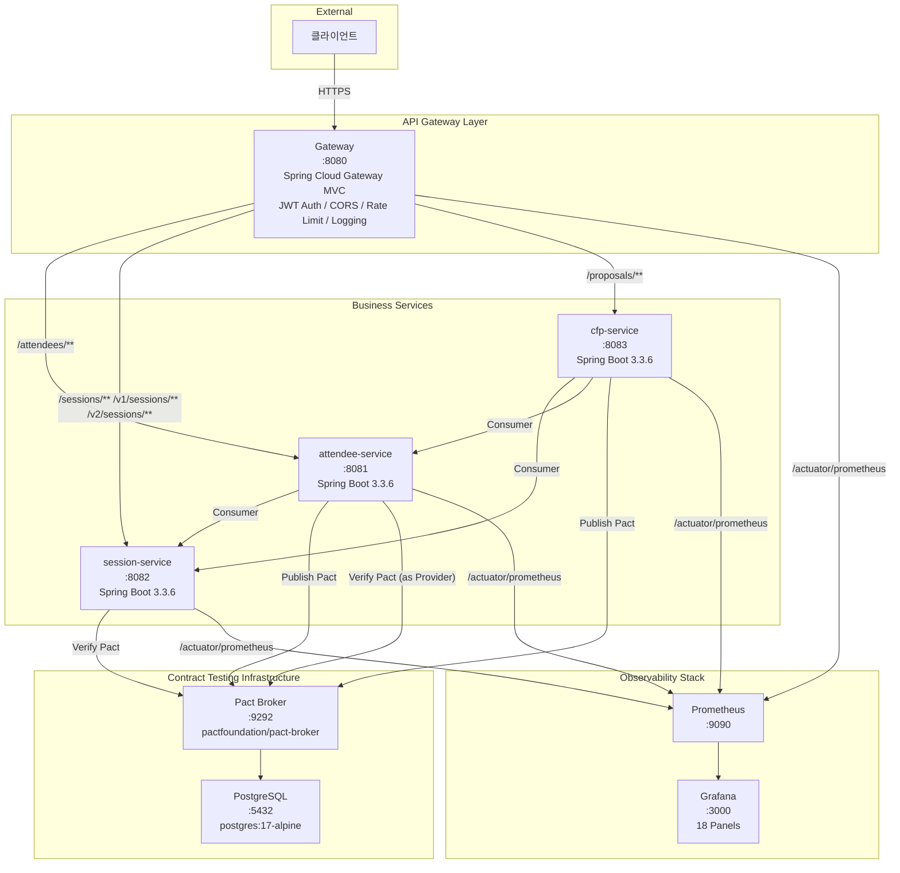
```mermaid
graph TB
    subgraph "External"
        Client[클라이언트]
    end

    subgraph "API Gateway Layer"
        GW["Gateway<br/>:8080<br/>Spring Cloud Gateway MVC<br/>JWT Auth / CORS / Rate Limit / Logging"]
    end

    subgraph "Business Services"
        ATT["attendee-service<br/>:8081<br/>Spring Boot 3.3.6"]
        SES["session-service<br/>:8082<br/>Spring Boot 3.3.6"]
        CFP["cfp-service<br/>:8083<br/>Spring Boot 3.3.6"]
    end

    subgraph "Contract Testing Infrastructure"
        PB["Pact Broker<br/>:9292<br/>pactfoundation/pact-broker"]
        PG["PostgreSQL<br/>:5432<br/>postgres:17-alpine"]
    end

    subgraph "Observability Stack"
        PROM["Prometheus<br/>:9090"]
        GRAF["Grafana<br/>:3000<br/>18 Panels"]
    end

    Client -->|HTTPS| GW
    GW -->|"/attendees/**"| ATT
    GW -->|"/sessions/** /v1/sessions/** /v2/sessions/**"| SES
    GW -->|"/proposals/**"| CFP

    CFP -->|Consumer| SES
    CFP -->|Consumer| ATT
    ATT -->|Consumer| SES

    ATT -->|Publish Pact| PB
    CFP -->|Publish Pact| PB
    SES -->|Verify Pact| PB
    ATT -->|"Verify Pact (as Provider)"| PB

    PB --> PG

    GW -->|"/actuator/prometheus"| PROM
    ATT -->|"/actuator/prometheus"| PROM
    SES -->|"/actuator/prometheus"| PROM
    CFP -->|"/actuator/prometheus"| PROM
    PROM --> GRAF
```

### 2.2 서비스 간 통신

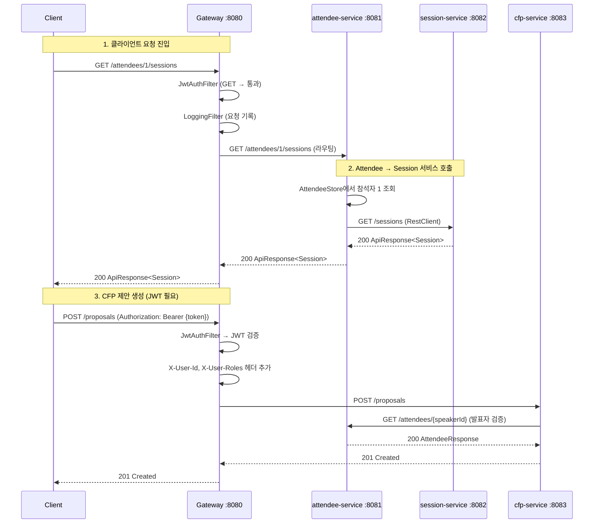
```mermaid
sequenceDiagram
    participant Client
    participant GW as Gateway :8080
    participant ATT as attendee-service :8081
    participant SES as session-service :8082
    participant CFP as cfp-service :8083

    Note over Client,GW: 1. 클라이언트 요청 진입

    Client->>GW: GET /attendees/1/sessions
    GW->>GW: JwtAuthFilter (GET → 통과)
    GW->>GW: LoggingFilter (요청 기록)
    GW->>ATT: GET /attendees/1/sessions (라우팅)

    Note over ATT,SES: 2. Attendee → Session 서비스 호출

    ATT->>ATT: AttendeeStore에서 참석자 1 조회
    ATT->>SES: GET /sessions (RestClient)
    SES-->>ATT: 200 ApiResponse<Session>
    ATT-->>GW: 200 ApiResponse<Session>
    GW-->>Client: 200 ApiResponse<Session>

    Note over Client,GW: 3. CFP 제안 생성 (JWT 필요)

    Client->>GW: POST /proposals (Authorization: Bearer {token})
    GW->>GW: JwtAuthFilter → JWT 검증
    GW->>GW: X-User-Id, X-User-Roles 헤더 추가
    GW->>CFP: POST /proposals
    CFP->>ATT: GET /attendees/{speakerId} (발표자 검증)
    ATT-->>CFP: 200 AttendeeResponse
    CFP-->>GW: 201 Created
    GW-->>Client: 201 Created
```

### 2.3 Pact CDC 계약 관계도

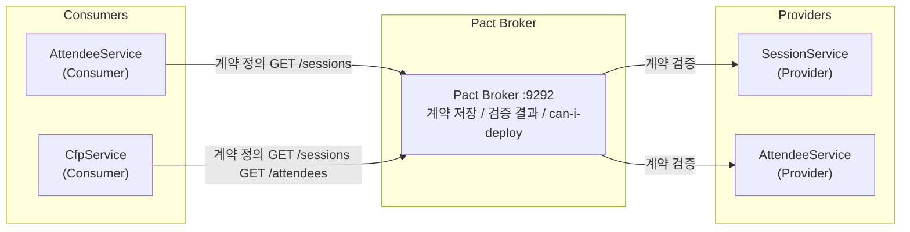
```mermaid
graph LR
    subgraph "Consumers"
        ATT_C["AttendeeService<br/>(Consumer)"]
        CFP_C["CfpService<br/>(Consumer)"]
    end

    subgraph "Providers"
        SES_P["SessionService<br/>(Provider)"]
        ATT_P["AttendeeService<br/>(Provider)"]
    end

    subgraph "Pact Broker"
        PB["Pact Broker :9292<br/>계약 저장 / 검증 결과 / can-i-deploy"]
    end

    ATT_C -->|"계약 정의 GET /sessions"| PB
    CFP_C -->|"계약 정의 GET /sessions GET /attendees"| PB

    PB -->|"계약 검증"| SES_P
    PB -->|"계약 검증"| ATT_P
```

### 2.4 모듈 구조


```mermaid
graph TD
    ROOT["pact-conference-demo<br/>(Gradle Multi-Module)"]

    ROOT --> COMMON["common<br/>Shared Kernel"]
    ROOT --> GW["gateway<br/>Spring Cloud Gateway MVC"]
    ROOT --> ATT["attendee-service<br/>Spring Boot"]
    ROOT --> SES["session-service<br/>Spring Boot"]
    ROOT --> CFP["cfp-service<br/>Spring Boot"]

    COMMON --> M1["model/<br/>Session, Attendee, ApiResponse"]
    COMMON --> M2["exception/<br/>ResourceNotFoundException<br/>GlobalExceptionHandler"]
    COMMON --> M3["security/<br/>JwtUtil, UserContext<br/>RoleCheckInterceptor, RoleRequired"]

    GW --> G1["filter/<br/>JwtAuthFilter, LoggingFilter"]
    GW --> G2["config/<br/>CorsConfig, RateLimitConfig"]
    GW --> G3["controller/<br/>AuthController<br/>ProxyController"]

    ATT --> A1["controller/<br/>AttendeeController"]
    ATT --> A2["store/<br/>AttendeeStore"]
    ATT --> A3["client/<br/>SessionClient"]
    ATT --> A4["dto/<br/>AttendeeDto"]

    SES --> S1["controller/<br/>SessionController<br/>SessionV1Controller<br/>SessionV2Controller"]
    SES --> S2["store/<br/>SessionStoreInterface<br/>SessionStore InMemory<br/>JpaSessionStore JPA"]
    SES --> S3["dto/<br/>SessionDto, SessionV2Dto"]
    SES --> S4["entity/<br/>SessionEntity"]

    CFP --> C1["controller/<br/>CfpController"]
    CFP --> C2["store/<br/>ProposalStore, VoteStore"]
    CFP --> C3["client/<br/>SessionClient, AttendeeClient"]
    CFP --> C4["config/<br/>FeatureFlags"]
    CFP --> C5["model/<br/>Proposal, Vote"]
```

### 2.5 전체 디렉토리 구조

```
pact-conference-demo/
├── build.gradle.kts                    # 루트 빌드 설정
├── settings.gradle.kts                 # 멀티 모듈 선언 (5 modules)
├── gradle.properties                   # Kotlin, Spring Boot 버전 관리
├── docker-compose.yml                  # Pact Broker + PostgreSQL
├── docker-compose.monitoring.yml       # Prometheus + Grafana
├── start-all.sh / stop-all.sh          # 전체 서비스 기동/종료 스크립트
│
├── common/                             # Shared Kernel 모듈
│   └── src/main/kotlin/com/conference/common/
│       ├── model/
│       │   ├── Session.kt
│       │   ├── Attendee.kt
│       │   └── ApiResponse.kt
│       ├── exception/
│       │   ├── Exceptions.kt
│       │   └── GlobalExceptionHandler.kt
│       └── security/
│           ├── JwtUtil.kt
│           ├── UserContext.kt
│           ├── RoleRequired.kt
│           ├── RoleCheckInterceptor.kt
│           └── SecurityWebConfig.kt
│
├── gateway/                            # API Gateway (포트 8080)
│   └── src/
│       ├── main/
│       │   ├── kotlin/com/conference/gateway/
│       │   │   ├── GatewayApplication.kt
│       │   │   ├── filter/
│       │   │   │   ├── JwtAuthFilter.kt
│       │   │   │   └── LoggingFilter.kt
│       │   │   ├── config/
│       │   │   │   ├── CorsConfig.kt
│       │   │   │   └── RateLimitConfig.kt
│       │   │   └── controller/
│       │   │       ├── AuthController.kt
│       │   │       └── ProxyController.kt
│       │   └── resources/application.yml
│       └── test/kotlin/com/conference/gateway/
│           └── RouteTest.kt
│
├── attendee-service/                   # 참석자 서비스 (포트 8081)
│   └── src/
│       ├── main/kotlin/com/conference/attendee/
│       │   ├── AttendeeServiceApplication.kt
│       │   ├── controller/AttendeeController.kt
│       │   ├── store/AttendeeStore.kt
│       │   ├── client/SessionClient.kt
│       │   ├── dto/AttendeeDto.kt
│       │   └── config/
│       │       ├── RestClientConfig.kt
│       │       ├── OpenApiConfig.kt
│       │       └── MetricsConfig.kt
│       └── test/kotlin/com/conference/attendee/
│           ├── component/AttendeeApiComponentTest.kt
│           └── pact/
│               ├── SessionServiceConsumerPactTest.kt  # Consumer
│               └── AttendeeServiceProviderPactTest.kt # Provider
│
├── session-service/                    # 세션 서비스 (포트 8082)
│   └── src/
│       ├── main/kotlin/com/conference/session/
│       │   ├── SessionServiceApplication.kt
│       │   ├── controller/
│       │   │   ├── SessionController.kt
│       │   │   ├── SessionV1Controller.kt
│       │   │   └── SessionV2Controller.kt
│       │   ├── store/
│       │   │   ├── SessionStoreInterface.kt
│       │   │   ├── SessionStore.kt         # @Profile("default")
│       │   │   └── JpaSessionStore.kt      # @Profile("jpa")
│       │   ├── entity/SessionEntity.kt
│       │   ├── repository/SessionJpaRepository.kt
│       │   ├── dto/
│       │   │   ├── SessionDto.kt
│       │   │   └── SessionV2Dto.kt
│       │   └── config/
│       │       ├── OpenApiConfig.kt
│       │       └── MetricsConfig.kt
│       └── test/kotlin/com/conference/session/
│           ├── controller/SessionControllerTest.kt
│           ├── controller/SessionVersioningTest.kt
│           ├── component/SessionApiComponentTest.kt
│           ├── integration/SessionRepositoryIntegrationTest.kt
│           └── pact/SessionServiceProviderPactTest.kt
│
├── cfp-service/                        # CFP 서비스 (포트 8083)
│   └── src/
│       ├── main/kotlin/com/conference/cfp/
│       │   ├── CfpServiceApplication.kt
│       │   ├── controller/CfpController.kt
│       │   ├── model/
│       │   │   ├── Proposal.kt
│       │   │   └── Vote.kt
│       │   ├── store/
│       │   │   ├── ProposalStore.kt
│       │   │   └── VoteStore.kt
│       │   ├── client/
│       │   │   ├── SessionClient.kt
│       │   │   └── AttendeeClient.kt
│       │   ├── dto/CfpDto.kt
│       │   └── config/
│       │       ├── FeatureFlags.kt
│       │       ├── RestClientConfig.kt
│       │       ├── OpenApiConfig.kt
│       │       └── MetricsConfig.kt
│       └── test/kotlin/com/conference/cfp/
│           ├── controller/CfpControllerTest.kt
│           ├── component/CfpApiComponentTest.kt
│           ├── config/FeatureFlagTest.kt
│           └── pact/
│               ├── SessionServiceConsumerPactTest.kt  # Consumer
│               └── AttendeeServiceConsumerPactTest.kt # Consumer
│
├── k8s/                                # Kubernetes manifests
│   ├── gateway-deployment.yaml
│   ├── attendee-service-deployment.yaml
│   ├── session-service-deployment.yaml
│   ├── cfp-service-deployment.yaml
│   └── pact-broker-deployment.yaml
│
├── monitoring/                         # Observability 설정
│   ├── prometheus.yml
│   └── grafana/
│       └── provisioning/
│           ├── datasources/datasource.yml
│           └── dashboards/dashboard.yml
│
├── docs/                               # 문서
│   ├── ARCHITECTURE.md                 # (이 파일)
│   ├── USER_GUIDE.md
│   ├── adr/                            # ADR-001 ~ ADR-006
│   ├── c4/                             # C4 Model 다이어그램
│   ├── ddd/                            # Domain-Driven Design
│   ├── security/                       # 보안 아키텍처
│   ├── cloud-migration/                # 6R, Strangler Fig, Branch by Abstraction
│   └── service-mesh/                   # Istio 설정
│
└── performance-test/                   # 성능 테스트
```

---

## 3. 기술 스택

### 3.1 핵심 기술

| 분류 | 기술 | 버전 |
|------|------|------|
| 언어 | Kotlin | 1.9.25 |
| 런타임 | JDK (Eclipse Temurin) | 21 (LTS) |
| 프레임워크 | Spring Boot | 3.3.6 |
| 빌드 도구 | Gradle Kotlin DSL | 8.x |
| API Gateway | Spring Cloud Gateway MVC | 2023.0.3 |

### 3.2 테스트 스택

| 분류 | 기술 | 버전 |
|------|------|------|
| CDC 테스트 | Pact JVM (Consumer + Provider) | 4.6.14 |
| Mocking | MockK | 1.13.13 |
| HTTP 테스트 | REST-Assured | 5.4.0 |
| DB 테스트 | Testcontainers (PostgreSQL) | - |

### 3.3 서비스 지원 라이브러리

| 분류 | 기술 | 버전 |
|------|------|------|
| API 문서화 | Springdoc OpenAPI | 2.3.0 |
| 메트릭 | Micrometer Prometheus | - |
| JWT | JJWT | - |
| 데이터베이스 | Spring Data JPA + PostgreSQL | - |

### 3.4 인프라 스택

| 분류 | 기술 | 버전/이미지 |
|------|------|------------|
| 컨테이너 런타임 | Docker | eclipse-temurin:21-jre-alpine |
| 컨테이너 오케스트레이션 | Kubernetes | - |
| 서비스 메시 | Istio | - |
| 계약 저장소 | Pact Broker | pactfoundation/pact-broker:latest |
| Pact Broker DB | PostgreSQL | postgres:17-alpine |
| 메트릭 수집 | Prometheus | :9090 |
| 대시보드 | Grafana | :3000 |

---

## 4. API Gateway 아키텍처

### 4.1 Gateway 요청 처리 흐름

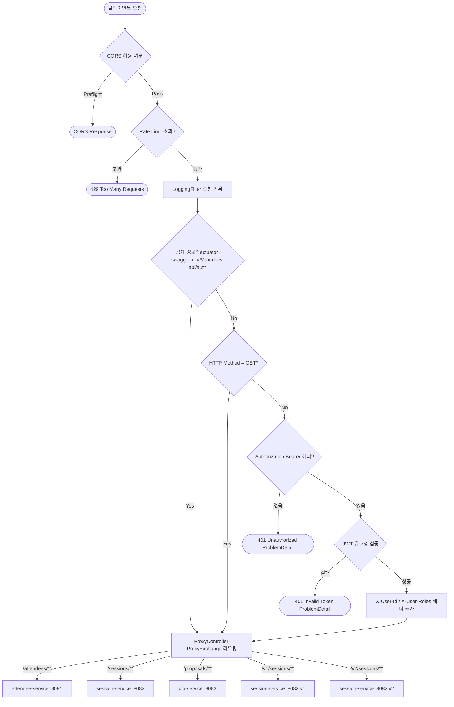
```mermaid
flowchart TD
    REQ([클라이언트 요청]) --> CORS{"CORS 허용 여부"}
    CORS -->|Preflight| CORS_RES([CORS Response])
    CORS -->|Pass| RATE{"Rate Limit 초과?"}
    RATE -->|초과| RATE_ERR([429 Too Many Requests])
    RATE -->|통과| LOG["LoggingFilter 요청 기록"]
    LOG --> PUBLIC{"공개 경로? actuator swagger-ui v3/api-docs api/auth"}
    PUBLIC -->|Yes| ROUTE["ProxyController ProxyExchange 라우팅"]
    PUBLIC -->|No| METHOD{"HTTP Method = GET?"}
    METHOD -->|Yes| ROUTE
    METHOD -->|No| JWT{"Authorization Bearer 헤더?"}
    JWT -->|없음| ERR401(["401 Unauthorized ProblemDetail"])
    JWT -->|있음| VALID{"JWT 유효성 검증"}
    VALID -->|실패| ERR401_2(["401 Invalid Token ProblemDetail"])
    VALID -->|성공| HEADER["X-User-Id / X-User-Roles 헤더 추가"]
    HEADER --> ROUTE
    ROUTE -->|"/attendees/**"| ATT["attendee-service :8081"]
    ROUTE -->|"/sessions/**"| SES["session-service :8082"]
    ROUTE -->|"/proposals/**"| CFP["cfp-service :8083"]
    ROUTE -->|"/v1/sessions/**"| SES_V1["session-service :8082 v1"]
    ROUTE -->|"/v2/sessions/**"| SES_V2["session-service :8082 v2"]
```

### 4.2 라우팅 규칙

`ProxyController` 기준:

| Route ID | 경로 패턴 | 대상 서비스 |
|----------|----------|-----------|
| attendee-service | `/attendees/**` | `http://localhost:8081` |
| session-service | `/sessions/**` | `http://localhost:8082` |
| cfp-service | `/proposals/**` | `http://localhost:8083` |
| session-service-v1 | `/v1/sessions/**` | `http://localhost:8082` |
| session-service-v2 | `/v2/sessions/**` | `http://localhost:8082` |

### 4.3 필터 체인

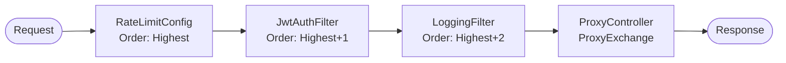
```mermaid
graph LR
    REQ([Request]) --> RL["RateLimitConfig<br/>Order: Highest"]
    RL --> JWT_F["JwtAuthFilter<br/>Order: Highest+1"]
    JWT_F --> LOG_F["LoggingFilter<br/>Order: Highest+2"]
    LOG_F --> SCG["ProxyController<br/>ProxyExchange"]
    SCG --> RES([Response])
```

| 필터 | 클래스 | 역할 |
|------|--------|------|
| RateLimitConfig | `RateLimitConfig` | 요청 빈도 제한 |
| JwtAuthFilter | `JwtAuthFilter` | JWT 검증 + 헤더 전파 |
| LoggingFilter | `LoggingFilter` | 요청/응답 로깅 |

### 4.4 CORS 설정

`CorsConfig`에서 Cross-Origin 요청을 허용합니다:

- `allowedOrigins`: 설정된 허용 도메인
- `allowedMethods`: GET, POST, PUT, DELETE, OPTIONS
- `allowedHeaders`: Authorization, Content-Type, X-User-Id, X-User-Roles
- `allowCredentials`: true

---

## 5. 보안 아키텍처

### 5.1 보안 흐름

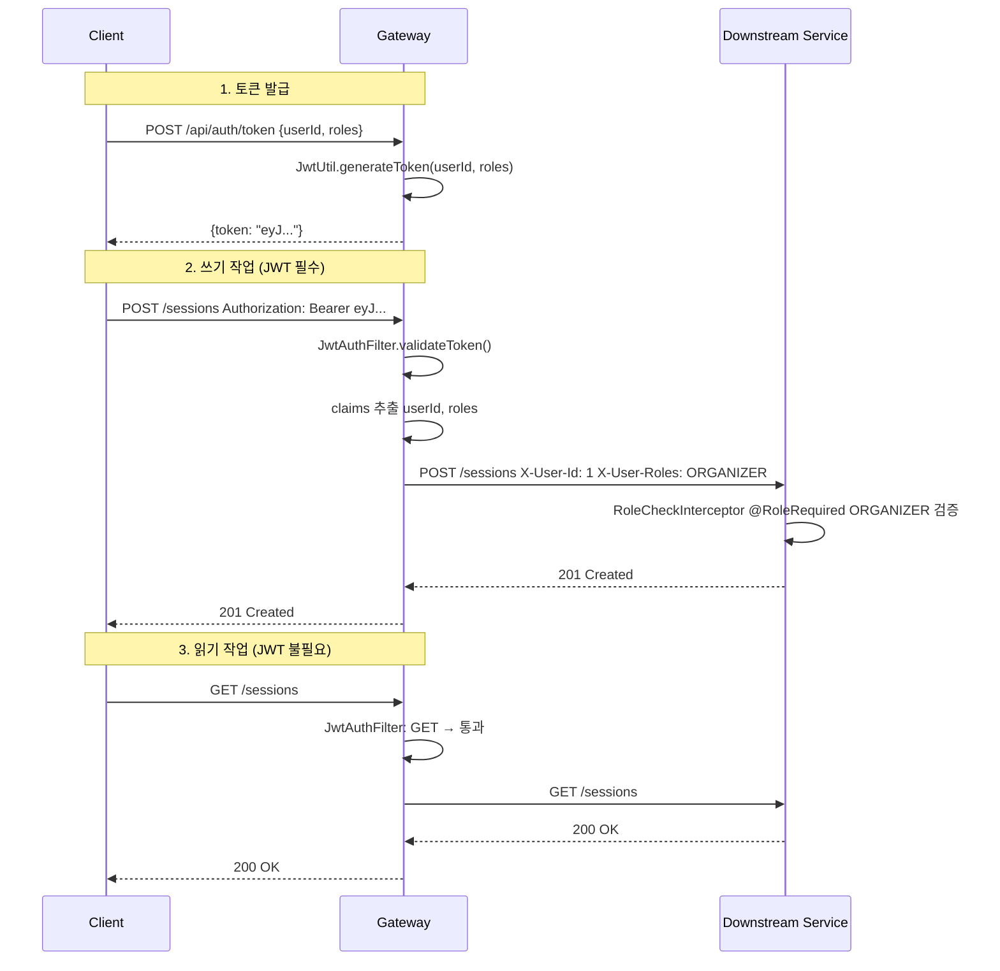
```mermaid
sequenceDiagram
    participant C as Client
    participant GW as Gateway
    participant DS as Downstream Service

    Note over C,GW: 1. 토큰 발급
    C->>GW: POST /api/auth/token {userId, roles}
    GW->>GW: JwtUtil.generateToken(userId, roles)
    GW-->>C: {token: "eyJ..."}

    Note over C,GW: 2. 쓰기 작업 (JWT 필수)
    C->>GW: POST /sessions Authorization: Bearer eyJ...
    GW->>GW: JwtAuthFilter.validateToken()
    GW->>GW: claims 추출 userId, roles
    GW->>DS: POST /sessions X-User-Id: 1 X-User-Roles: ORGANIZER
    DS->>DS: RoleCheckInterceptor @RoleRequired ORGANIZER 검증
    DS-->>GW: 201 Created
    GW-->>C: 201 Created

    Note over C,GW: 3. 읽기 작업 (JWT 불필요)
    C->>GW: GET /sessions
    GW->>GW: JwtAuthFilter: GET → 통과
    GW->>DS: GET /sessions
    DS-->>GW: 200 OK
    GW-->>C: 200 OK
```

### 5.2 JWT 구조

`common/security/JwtUtil.kt` 구현:

| 항목 | 값 |
|------|-----|
| 알고리즘 | HMAC-SHA256 (HS256) |
| 만료 시간 | 1시간 (3,600,000ms) |
| Claims | `sub` (userId), `roles` (List), `iat`, `exp` |

```
Header: {"alg":"HS256","typ":"JWT"}
Payload: {"sub":"1","roles":["ORGANIZER"],"iat":...,"exp":...}
Signature: HMACSHA256(base64(header) + "." + base64(payload), secret)
```

### 5.3 Role-Based Access Control (RBAC)

| 역할 | 권한 | 사용 상황 |
|------|------|---------|
| `ATTENDEE` | 읽기 전용 | 세션/참석자 조회 |
| `ORGANIZER` | 읽기 + 쓰기 | 세션 생성/수정/삭제, 제안 관리 |

**게이트웨이 레벨 정책:**
- `GET` 요청: 인증 없이 허용 (데모 편의성)
- `POST`, `PUT`, `DELETE`: JWT Bearer 토큰 필수

**서비스 레벨 RBAC:**
- `@RoleRequired("ORGANIZER")`: `RoleCheckInterceptor`가 `X-User-Roles` 헤더 검사
- `UserContext`: `ThreadLocal<UserContext>` 패턴으로 요청 컨텍스트 전파

### 5.4 UserContext ThreadLocal 패턴

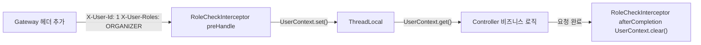
```mermaid
graph LR
    GW_H["Gateway 헤더 추가"] -->|"X-User-Id: 1 X-User-Roles: ORGANIZER"| RCI
    RCI["RoleCheckInterceptor preHandle"] -->|"UserContext.set()"| TL[ThreadLocal]
    TL -->|"UserContext.get()"| CTRL["Controller 비즈니스 로직"]
    CTRL -->|요청 완료| CLEANUP["RoleCheckInterceptor afterCompletion UserContext.clear()"]
```

---

## 6. API 설계

### 6.1 전체 엔드포인트 목록

#### Session Service (포트 8082)

| Method | 경로 | 설명 | 인증 |
|--------|------|------|------|
| GET | `/sessions` | 전체 세션 목록 | 불필요 |
| GET | `/sessions/{id}` | 세션 단건 조회 | 불필요 |
| POST | `/sessions` | 새 세션 생성 | JWT 필요 |
| PUT | `/sessions/{id}` | 세션 수정 | JWT 필요 |
| DELETE | `/sessions/{id}` | 세션 삭제 | JWT 필요 |
| GET | `/v1/sessions` | V1 세션 목록 | 불필요 |
| GET | `/v1/sessions/{id}` | V1 세션 단건 | 불필요 |
| GET | `/v2/sessions` | V2 세션 목록 (tags, capacity 추가) | 불필요 |
| GET | `/v2/sessions/{id}` | V2 세션 단건 | 불필요 |

#### Attendee Service (포트 8081)

| Method | 경로 | 설명 | 인증 |
|--------|------|------|------|
| GET | `/attendees` | 전체 참석자 목록 | 불필요 |
| GET | `/attendees/{id}` | 참석자 단건 조회 | 불필요 |
| GET | `/attendees/{id}/sessions` | 참석자 세션 목록 (SessionService 호출) | 불필요 |
| POST | `/attendees` | 참석자 등록 | JWT 필요 |
| PUT | `/attendees/{id}` | 참석자 정보 수정 | JWT 필요 |
| DELETE | `/attendees/{id}` | 참석자 삭제 | JWT 필요 |

#### CFP Service (포트 8083)

| Method | 경로 | 설명 | 인증 |
|--------|------|------|------|
| GET | `/proposals` | 전체 제안 목록 | 불필요 |
| GET | `/proposals/{id}` | 제안 단건 조회 | 불필요 |
| POST | `/proposals` | 새 제안 접수 (발표자 검증 포함) | JWT 필요 |
| PUT | `/proposals/{id}` | 제안 수정 | JWT 필요 |
| DELETE | `/proposals/{id}` | 제안 삭제 | JWT 필요 |
| POST | `/proposals/{id}/votes` | 투표 추가 | JWT 필요 |
| GET | `/proposals/{id}/votes` | 투표 결과 조회 (Feature Flag 적용) | 불필요 |

### 6.2 DTO 분리 패턴

모든 서비스는 요청/응답 DTO를 도메인 모델과 분리합니다:

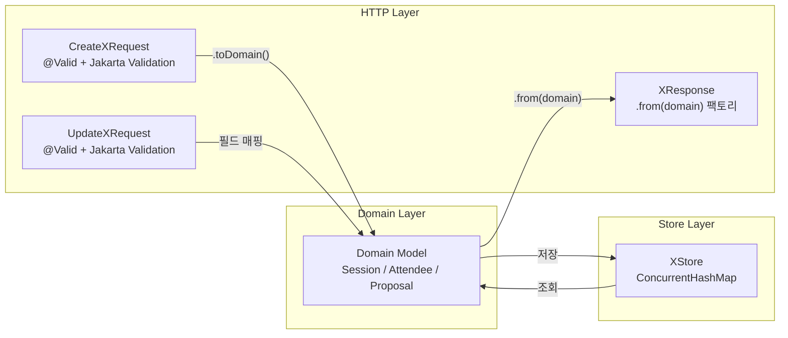
```mermaid
graph LR
    subgraph "HTTP Layer"
        CRQ["CreateXRequest<br/>@Valid + Jakarta Validation"]
        URQ["UpdateXRequest<br/>@Valid + Jakarta Validation"]
        RES["XResponse<br/>.from(domain) 팩토리"]
    end

    subgraph "Domain Layer"
        DOM["Domain Model<br/>Session / Attendee / Proposal"]
    end

    subgraph "Store Layer"
        STORE["XStore<br/>ConcurrentHashMap"]
    end

    CRQ -->|".toDomain()"| DOM
    URQ -->|필드 매핑| DOM
    DOM -->|저장| STORE
    STORE -->|조회| DOM
    DOM -->|".from(domain)"| RES
```

**예시 (Session)**:
- `CreateSessionRequest`: title(필수), speaker(필수), description(선택), dateTime(선택)
- `UpdateSessionRequest`: 전체 필드 업데이트
- `SessionResponse`: id + 전체 필드 응답
- `SessionV2Response`: SessionResponse + tags(List) + capacity(Int)

### 6.3 RFC 7807 ProblemDetail 에러 응답

`common/exception/GlobalExceptionHandler.kt`에서 모든 예외를 `ProblemDetail` 형식으로 변환합니다:

```json
{
  "type": "https://conference.example.com/errors/not-found",
  "title": "Not Found",
  "status": 404,
  "detail": "Session with id 999 not found",
  "instance": "/sessions/999"
}
```

| 예외 클래스 | HTTP 상태 | type URI |
|------------|----------|---------|
| `ResourceNotFoundException` | 404 | `.../not-found` |
| `MethodArgumentNotValidException` | 400 | `.../validation-error` |
| `Exception` (기타) | 500 | `.../internal-error` |

### 6.4 Input Validation

Jakarta Validation (`@Valid`) 어노테이션을 활용합니다:

```kotlin
data class CreateSessionRequest(
    @field:NotBlank(message = "title은 필수입니다")
    val title: String,

    @field:NotBlank(message = "speaker는 필수입니다")
    val speaker: String,

    val description: String? = null,
    val dateTime: LocalDateTime? = null
)
```

---

## 7. 데이터 저장소 아키텍처

### 7.1 Branch by Abstraction 패턴

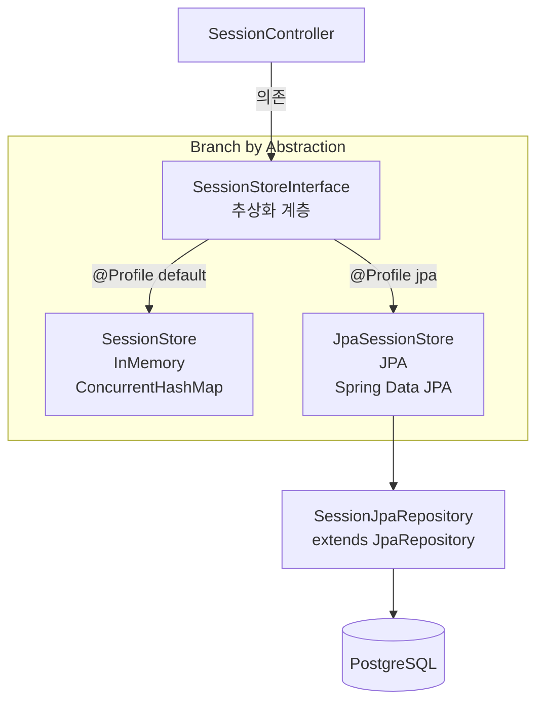
```mermaid
graph TB
    CTRL[SessionController] -->|의존| IFACE["SessionStoreInterface<br/>추상화 계층"]

    IFACE -->|"@Profile default"| MEM["SessionStore<br/>InMemory<br/>ConcurrentHashMap"]
    IFACE -->|"@Profile jpa"| JPA["JpaSessionStore<br/>JPA<br/>Spring Data JPA"]

    JPA --> REPO["SessionJpaRepository<br/>extends JpaRepository"]
    REPO --> DB[(PostgreSQL)]

    subgraph "Branch by Abstraction"
        IFACE
        MEM
        JPA
    end
```

| 프로필 | 구현체 | 저장소 | 사용 상황 |
|--------|--------|--------|---------|
| `default` | `SessionStore` | `ConcurrentHashMap` | 로컬 개발, 테스트 |
| `jpa` | `JpaSessionStore` | PostgreSQL (Spring Data JPA) | DB 연동 데모 |

### 7.2 SessionStoreInterface

```kotlin
interface SessionStoreInterface {
    fun getSessions(): List<Session>
    fun getSession(id: Int): Session?
    fun addSession(session: Session): Session
    fun updateSession(id: Int, session: Session): Session?
    fun removeSession(id: Int): Boolean
    fun clear()                          // Provider Pact 테스트의 @State 설정에 활용
}
```

`clear()` 메서드는 Provider Pact 검증 테스트에서 `@State` 핸들러가 테스트 격리를 위해 저장소를 초기화할 때 사용됩니다.

### 7.3 서비스별 저장소 구현

| 서비스 | 저장소 | 구현 방식 |
|--------|--------|---------|
| session-service | `SessionStoreInterface` | InMemory / JPA (Profile 전환) |
| attendee-service | `AttendeeStore` | InMemory ConcurrentHashMap |
| cfp-service | `ProposalStore` | InMemory ConcurrentHashMap |
| cfp-service | `VoteStore` | InMemory ConcurrentHashMap |

### 7.4 스레드 안전성

모든 InMemory 저장소는 `ConcurrentHashMap`과 `AtomicInteger`를 사용합니다:

```kotlin
private val counter = AtomicInteger(3)              // Thread-safe ID 생성
private val store: ConcurrentHashMap<Int, Session>  // Thread-safe 저장
```

---

## 8. 테스트 아키텍처

### 8.1 테스트 피라미드

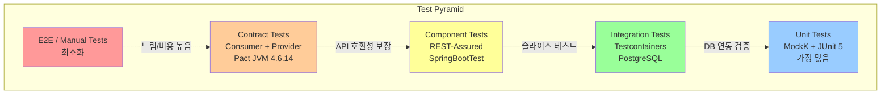
```mermaid
graph TB
    subgraph "Test Pyramid"
        E2E["E2E / Manual Tests<br/>최소화"]
        CONTRACT["Contract Tests<br/>Consumer + Provider<br/>Pact JVM 4.6.14"]
        COMPONENT["Component Tests<br/>REST-Assured<br/>SpringBootTest"]
        INTEGRATION["Integration Tests<br/>Testcontainers<br/>PostgreSQL"]
        UNIT["Unit Tests<br/>MockK + JUnit 5<br/>가장 많음"]
    end

    E2E -.->|"느림/비용 높음"| CONTRACT
    CONTRACT -->|"API 호환성 보장"| COMPONENT
    COMPONENT -->|"슬라이스 테스트"| INTEGRATION
    INTEGRATION -->|"DB 연동 검증"| UNIT

    style E2E fill:#ff9999
    style CONTRACT fill:#ffcc99
    style COMPONENT fill:#ffff99
    style INTEGRATION fill:#99ff99
    style UNIT fill:#99ccff
```

### 8.2 테스트 파일 매핑

| 테스트 유형 | 클래스 | 대상 서비스 |
|-----------|--------|-----------|
| Unit | `SessionControllerTest` | session-service |
| Unit | `CfpControllerTest` | cfp-service |
| Unit | `FeatureFlagTest` | cfp-service |
| Component | `SessionApiComponentTest` | session-service |
| Component | `AttendeeApiComponentTest` | attendee-service |
| Component | `CfpApiComponentTest` | cfp-service |
| Integration | `SessionRepositoryIntegrationTest` | session-service (Testcontainers) |
| Contract (Consumer) | `SessionServiceConsumerPactTest` (attendee) | attendee → session |
| Contract (Consumer) | `SessionServiceConsumerPactTest` (cfp) | cfp → session |
| Contract (Consumer) | `AttendeeServiceConsumerPactTest` (cfp) | cfp → attendee |
| Contract (Provider) | `SessionServiceProviderPactTest` | session (Provider) |
| Contract (Provider) | `AttendeeServiceProviderPactTest` | attendee (Provider) |
| Route | `RouteTest` | gateway |

### 8.3 Pact CDC 테스트 전체 흐름

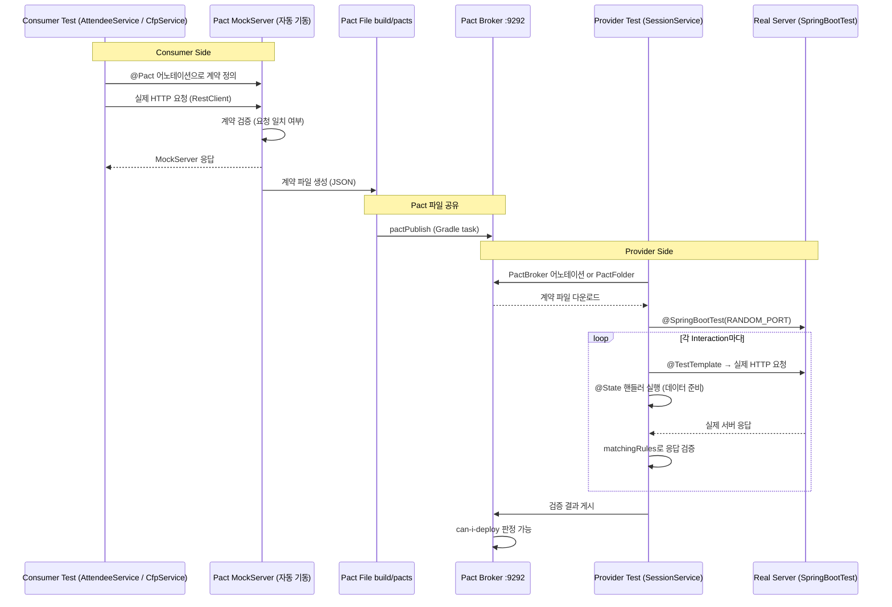
```mermaid
sequenceDiagram
    participant CS as Consumer Test (AttendeeService / CfpService)
    participant MS as Pact MockServer (자동 기동)
    participant PF as Pact File build/pacts
    participant PB as Pact Broker :9292
    participant PS as Provider Test (SessionService)
    participant RS as Real Server (SpringBootTest)

    Note over CS,MS: Consumer Side
    CS->>MS: @Pact 어노테이션으로 계약 정의
    CS->>MS: 실제 HTTP 요청 (RestClient)
    MS->>MS: 계약 검증 (요청 일치 여부)
    MS-->>CS: MockServer 응답
    MS->>PF: 계약 파일 생성 (JSON)

    Note over PF,PB: Pact 파일 공유
    PF->>PB: pactPublish (Gradle task)

    Note over PB,RS: Provider Side
    PS->>PB: PactBroker 어노테이션 or PactFolder
    PB-->>PS: 계약 파일 다운로드
    PS->>RS: @SpringBootTest(RANDOM_PORT)
    loop 각 Interaction마다
        PS->>RS: @TestTemplate → 실제 HTTP 요청
        PS->>PS: @State 핸들러 실행 (데이터 준비)
        RS-->>PS: 실제 서버 응답
        PS->>PS: matchingRules로 응답 검증
    end
    PS->>PB: 검증 결과 게시
    PB->>PB: can-i-deploy 판정 가능
```

### 8.4 Consumer 테스트 구조

```kotlin
@ExtendWith(PactConsumerTestExt::class)
@PactTestFor(providerName = "SessionService", pactVersion = PactSpecVersion.V3)
class SessionServiceConsumerPactTest {

    @Pact(consumer = "CfpService")
    fun getSessionPact(builder: PactDslWithProvider): RequestResponsePact {
        return builder
            .given("세션 ID 1이 존재함")              // Provider State
            .uponReceiving("세션 조회 요청")            // Interaction 설명
            .path("/sessions/1").method("GET")
            .willRespondWith()
            .status(200)
            .body(
                PactDslJsonBody()
                    .integerType("id", 1L)            // 타입 매칭 (값 무관)
                    .stringType("title", "gRPC...")   // 문자열 타입 매칭
            )
            .toPact()
    }
}
```

### 8.5 Provider 테스트 구조

```kotlin
@Provider("SessionService")
@PactFolder("build/pacts")             // collectPacts task로 수집된 계약
@IgnoreNoPactsToVerify
@SpringBootTest(webEnvironment = SpringBootTest.WebEnvironment.RANDOM_PORT)
class SessionServiceProviderPactTest {

    @TestTemplate
    @ExtendWith(PactVerificationInvocationContextProvider::class)
    fun pactVerificationTestTemplate(context: PactVerificationContext?) {
        context?.verifyInteraction()   // 각 Interaction마다 자동 실행
    }

    @State("세션 ID 1이 존재함")        // Consumer의 .given()과 일치
    fun sessionWithId1Exists() {
        sessionStore.clear()
        sessionStore.addSession(Session(...))
    }
}
```

### 8.6 collectPacts Gradle Task

여러 Consumer 서비스의 계약 파일을 Provider의 `build/pacts` 디렉토리로 통합하는 커스텀 Task:

```
attendee-service/build/pacts/*.json  ──┐
cfp-service/build/pacts/*.json       ──┤──> session-service/build/pacts/
                                       │
cfp-service/build/pacts/*.json       ──┴──> attendee-service/build/pacts/
```

```
# Consumer 테스트 실행 후 계약 수집
./gradlew collectPacts

# Provider 검증
./gradlew :session-service:test
./gradlew :attendee-service:test
```

---

## 9. 관찰가능성 (Observability)

### 9.1 Observability 아키텍처

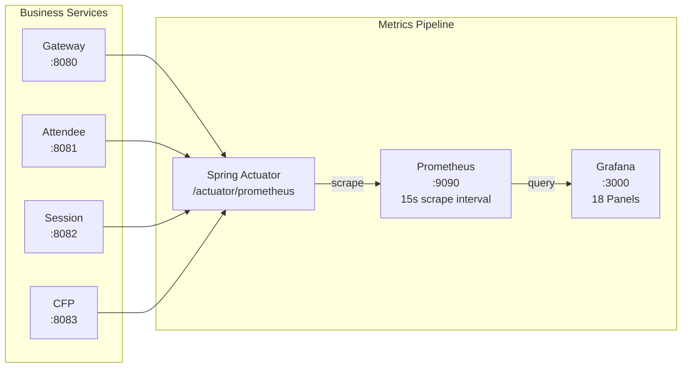
```mermaid
graph LR
    subgraph "Business Services"
        GW_S["Gateway<br/>:8080"]
        ATT_S["Attendee<br/>:8081"]
        SES_S["Session<br/>:8082"]
        CFP_S["CFP<br/>:8083"]
    end

    subgraph "Metrics Pipeline"
        ACT["Spring Actuator<br/>/actuator/prometheus"]
        PROM_S["Prometheus<br/>:9090<br/>15s scrape interval"]
        GRAF_S["Grafana<br/>:3000<br/>18 Panels"]
    end

    GW_S --> ACT
    ATT_S --> ACT
    SES_S --> ACT
    CFP_S --> ACT

    ACT -->|scrape| PROM_S
    PROM_S -->|query| GRAF_S
```

### 9.2 Spring Actuator 엔드포인트

각 서비스에서 노출하는 Actuator 엔드포인트:

| 엔드포인트 | 경로 | 내용 |
|---------|------|------|
| health | `/actuator/health` | 서비스 상태 (Kubernetes probe) |
| info | `/actuator/info` | 서비스 정보 |
| metrics | `/actuator/metrics` | Micrometer 메트릭 목록 |
| prometheus | `/actuator/prometheus` | Prometheus 스크레이핑 엔드포인트 |
| gateway | `/actuator/gateway` | Gateway 라우팅 정보 (Gateway 전용) |

### 9.3 커스텀 비즈니스 메트릭

각 서비스에서 도메인 특화 메트릭을 `Gauge`로 등록합니다:

| 메트릭 이름 | 서비스 | 설명 |
|-----------|--------|------|
| `conference.sessions.total` | session-service | 전체 세션 수 |
| `conference.attendees.total` | attendee-service | 전체 참석자 수 |
| `conference.proposals.total` | cfp-service | 전체 제안 수 |
| `conference.votes.total` | cfp-service | 전체 투표 수 |

```kotlin
// session-service/config/MetricsConfig.kt
@Configuration
class MetricsConfig(meterRegistry: MeterRegistry, sessionStore: SessionStoreInterface) {
    init {
        Gauge.builder("conference.sessions.total") {
            sessionStore.getSessions().size.toDouble()
        }
        .description("Total number of sessions")
        .register(meterRegistry)
    }
}
```

### 9.4 Prometheus 수집 설정

`monitoring/prometheus.yml`:

```yaml
global:
  scrape_interval: 15s      # 15초마다 메트릭 수집
  evaluation_interval: 15s

scrape_configs:
  - job_name: 'gateway'
    metrics_path: '/actuator/prometheus'
    static_configs:
      - targets: ['host.docker.internal:8080']
        labels: {service: 'gateway'}
  # attendee-service, session-service, cfp-service 동일
```

### 9.5 Grafana 대시보드

18개 패널로 구성된 컨퍼런스 모니터링 대시보드:

| 패널 카테고리 | 주요 패널 |
|------------|---------|
| 서비스 개요 | 서비스별 UP/DOWN 상태, 총 요청 수 |
| 비즈니스 메트릭 | 세션 수, 참석자 수, 제안 수, 투표 수 |
| HTTP 성능 | 요청률 (RPS), 응답 시간 (P50/P95/P99) |
| 에러 추적 | 4xx/5xx 에러율, 에러 분류 |
| JVM 상태 | Heap 사용량, GC 활동, 스레드 수 |

### 9.6 Feature Flags

`cfp-service/config/FeatureFlags.kt`:

```kotlin
@ConfigurationProperties(prefix = "features")
data class FeatureFlags(
    val newVotingAlgorithm: Boolean = false,   // 가중 평균 투표 알고리즘
    val detailedLogging: Boolean = false        // 상세 로깅
)
```

`application.yml`에서 런타임 활성화:

```yaml
features:
  new-voting-algorithm: true
  detailed-logging: false
```

Feature Flag에 따른 투표 평균 계산 분기:

```kotlin
val averageScore = if (featureFlags.newVotingAlgorithm) {
    voteStore.getWeightedAverageScore(id)   // 가중 평균 (신규 알고리즘)
} else {
    voteStore.getAverageScore(id)           // 단순 평균 (기존 알고리즘)
}
```

---

## 10. 인프라 아키텍처

### 10.1 Dockerfile 설계

모든 서비스는 최소 레이어 전략으로 `eclipse-temurin:21-jre-alpine` 기반 이미지를 사용합니다:

```dockerfile
FROM eclipse-temurin:21-jre-alpine
WORKDIR /app
COPY build/libs/*.jar app.jar
EXPOSE {포트}
ENTRYPOINT ["java", "-jar", "app.jar"]
```

| 설계 원칙 | 적용 내용 |
|---------|---------|
| 최소 베이스 이미지 | JRE only (JDK 미포함), Alpine Linux |
| 레이어 최소화 | COPY + ENTRYPOINT 2개 레이어만 추가 |
| 보안 | non-root 실행 권장 (향후 개선) |

### 10.2 Kubernetes 배포 구조

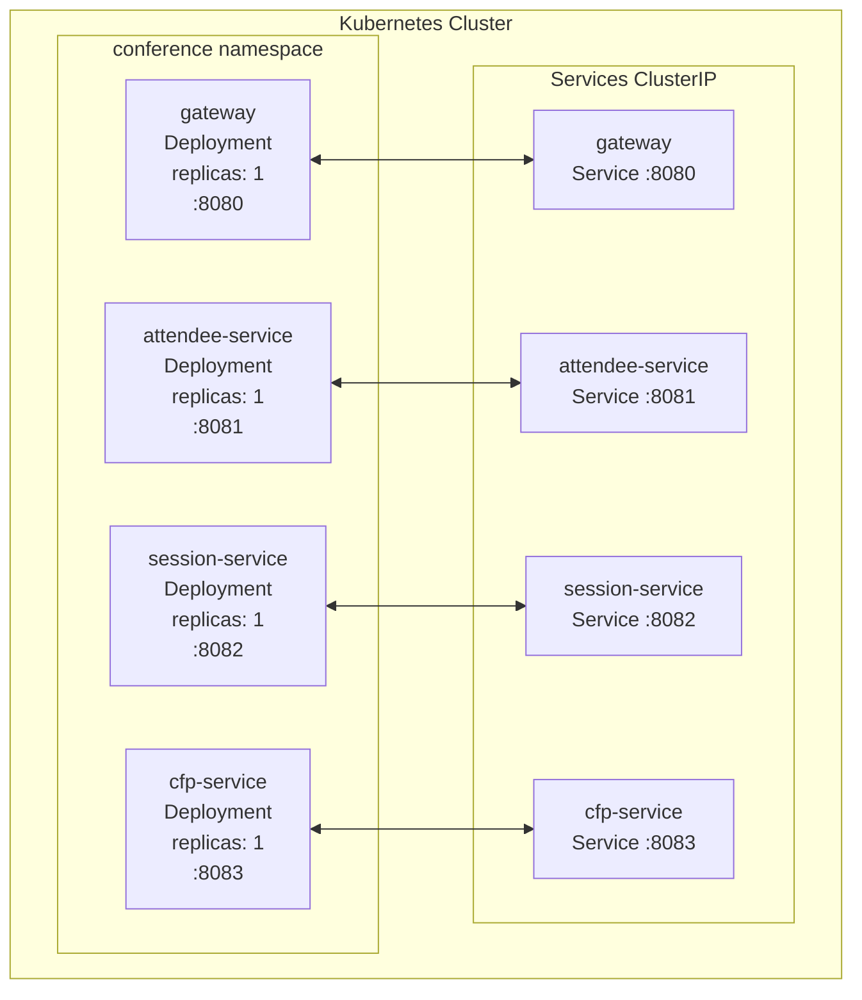
```mermaid
graph TB
    subgraph "Kubernetes Cluster"
        subgraph "conference namespace"
            GW_D["gateway<br/>Deployment<br/>replicas: 1<br/>:8080"]
            ATT_D["attendee-service<br/>Deployment<br/>replicas: 1<br/>:8081"]
            SES_D["session-service<br/>Deployment<br/>replicas: 1<br/>:8082"]
            CFP_D["cfp-service<br/>Deployment<br/>replicas: 1<br/>:8083"]
        end

        subgraph "Services ClusterIP"
            GW_SVC["gateway<br/>Service :8080"]
            ATT_SVC["attendee-service<br/>Service :8081"]
            SES_SVC["session-service<br/>Service :8082"]
            CFP_SVC["cfp-service<br/>Service :8083"]
        end
    end

    GW_D <--> GW_SVC
    ATT_D <--> ATT_SVC
    SES_D <--> SES_SVC
    CFP_D <--> CFP_SVC
```

**각 서비스 Deployment 공통 설정:**

| 설정 항목 | 값 |
|---------|-----|
| `requests.memory` | 256Mi |
| `requests.cpu` | 250m |
| `limits.memory` | 512Mi |
| `limits.cpu` | 500m |
| `readinessProbe` | `GET /actuator/health` (delay: 15s, period: 10s) |
| `livenessProbe` | `GET /actuator/health` (delay: 30s, period: 15s) |
| `SPRING_PROFILES_ACTIVE` | `default` (환경 변수로 전달) |

### 10.3 Service Mesh (Istio)

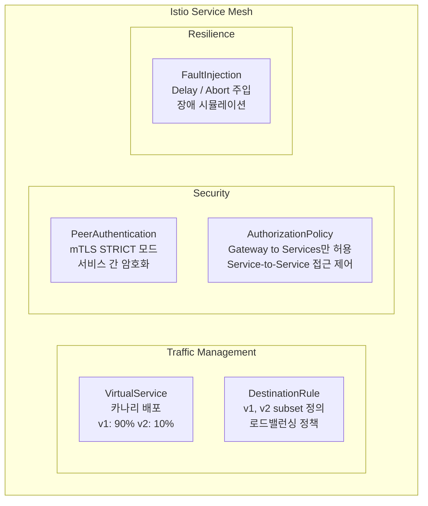
```mermaid
graph TB
    subgraph "Istio Service Mesh"
        subgraph "Traffic Management"
            VS["VirtualService<br/>카나리 배포<br/>v1: 90% v2: 10%"]
            DR["DestinationRule<br/>v1, v2 subset 정의<br/>로드밸런싱 정책"]
        end

        subgraph "Security"
            PA["PeerAuthentication<br/>mTLS STRICT 모드<br/>서비스 간 암호화"]
            AP["AuthorizationPolicy<br/>Gateway to Services만 허용<br/>Service-to-Service 접근 제어"]
        end

        subgraph "Resilience"
            FI["FaultInjection<br/>Delay / Abort 주입<br/>장애 시뮬레이션"]
        end
    end
```

**VirtualService 카나리 배포 (`docs/service-mesh/virtual-service.yaml`):**

```yaml
# session-service v1 → v2 점진적 전환
# x-api-version: v2 헤더 → v2로 라우팅
# 기본: v1 90% / v2 10%
- route:
    - destination: {host: session-service, subset: v1}
      weight: 90
    - destination: {host: session-service, subset: v2}
      weight: 10
```

### 10.4 Docker Compose 구성

**기본 인프라 (`docker-compose.yml`):**

```yaml
services:
  postgres:        # Pact Broker DB
    image: postgres:17-alpine
    ports: ["5432:5432"]

  pact-broker:     # 계약 저장소
    image: pactfoundation/pact-broker:latest
    depends_on: {postgres: {condition: service_healthy}}
    ports: ["9292:9292"]
```

**모니터링 인프라 (`docker-compose.monitoring.yml`):**

```yaml
services:
  prometheus:      # 메트릭 수집
    image: prom/prometheus
    ports: ["9090:9090"]

  grafana:         # 대시보드
    image: grafana/grafana
    ports: ["3000:3000"]
```

---

## 11. 클라우드 마이그레이션 전략

### 11.1 6R 전략 요약

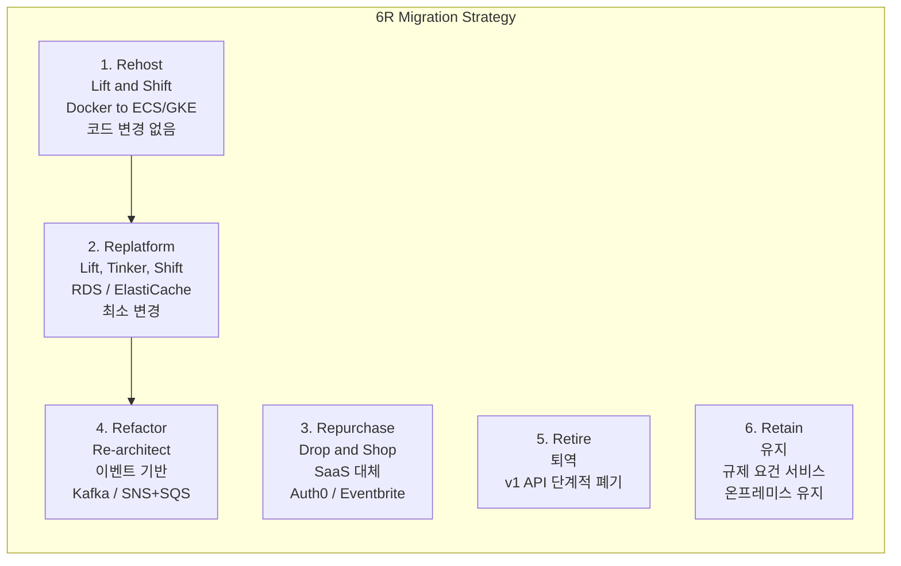
```mermaid
graph LR
    subgraph "6R Migration Strategy"
        RH["1. Rehost<br/>Lift and Shift<br/>Docker to ECS/GKE<br/>코드 변경 없음"]
        RP["2. Replatform<br/>Lift, Tinker, Shift<br/>RDS / ElastiCache<br/>최소 변경"]
        RPU["3. Repurchase<br/>Drop and Shop<br/>SaaS 대체<br/>Auth0 / Eventbrite"]
        RF["4. Refactor<br/>Re-architect<br/>이벤트 기반<br/>Kafka / SNS+SQS"]
        RT["5. Retire<br/>퇴역<br/>v1 API 단계적 폐기"]
        RN["6. Retain<br/>유지<br/>규제 요건 서비스<br/>온프레미스 유지"]
    end

    RH --> RP --> RF
```

| 단계 | 전략 | 대상 | 예상 효과 |
|------|------|------|---------|
| 1단계 | **Rehost** | 전체 서비스 | 빠른 클라우드 이전 |
| 2단계 | **Replatform** | DB, Cache, Auth | 운영 부담 감소 |
| 3단계 | **Refactor** | 이벤트 기반 전환 | 확장성/복원력 향상 |

### 11.2 Strangler Fig 패턴 적용 시나리오

Strangler Fig 패턴은 모놀리스를 점진적으로 마이크로서비스로 교체하는 전략입니다.

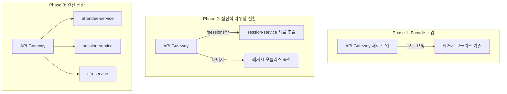
```mermaid
graph TD
    subgraph "Phase 1: Facade 도입"
        GW1["API Gateway 새로 도입"]
        MON1["레거시 모놀리스 기존"]
        GW1 -->|"모든 요청"| MON1
    end

    subgraph "Phase 2: 점진적 라우팅 전환"
        GW2["API Gateway"]
        MON2["레거시 모놀리스 축소"]
        SES2["session-service 새로 추출"]
        GW2 -->|"/sessions/**"| SES2
        GW2 -->|"나머지"| MON2
    end

    subgraph "Phase 3: 완전 전환"
        GW3["API Gateway"]
        ATT3["attendee-service"]
        SES3["session-service"]
        CFP3["cfp-service"]
        GW3 --> ATT3
        GW3 --> SES3
        GW3 --> CFP3
    end
```

### 11.3 Branch by Abstraction 패턴 (SessionStore 사례)

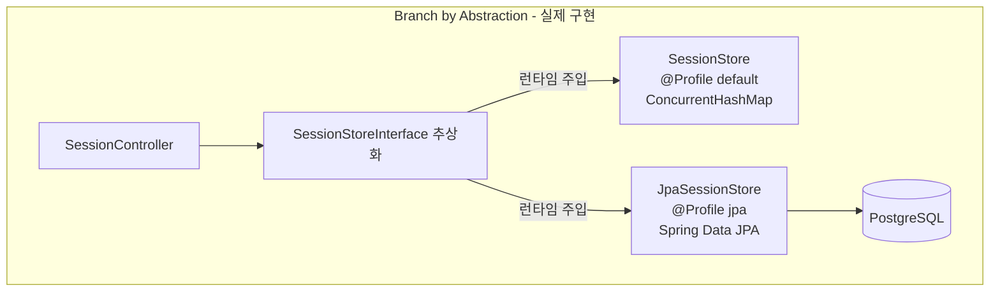
```mermaid
graph TB
    subgraph "Branch by Abstraction - 실제 구현"
        CTRL2["SessionController"]
        IFACE2["SessionStoreInterface 추상화"]
        MEM2["SessionStore<br/>@Profile default<br/>ConcurrentHashMap"]
        JPA2["JpaSessionStore<br/>@Profile jpa<br/>Spring Data JPA"]
        PG2[(PostgreSQL)]

        CTRL2 --> IFACE2
        IFACE2 -->|런타임 주입| MEM2
        IFACE2 -->|런타임 주입| JPA2
        JPA2 --> PG2
    end
```

**전환 절차:**
1. `SessionStoreInterface` 추상화 계층 생성
2. 기존 `SessionStore`를 `@Profile("default")`로 지정
3. `JpaSessionStore`를 `@Profile("jpa")`로 신규 개발
4. `SPRING_PROFILES_ACTIVE=jpa` 환경 변수로 전환 (재배포 없이)
5. 검증 완료 후 `SessionStore` 제거

---

## 12. 아키텍처 결정 기록 (ADR)

| ADR | 제목 | 상태 | 핵심 결정 |
|-----|------|------|---------|
| **ADR-001** | 마이크로서비스 분리 전략 | 승인 | 도메인 경계(Bounded Context)에 따라 3개 서비스로 분리. common 모듈을 Shared Kernel로 관리 |
| **ADR-002** | Pact CDC 테스트 선택 | 승인 | Pact JVM 4.6.14 채택. Consumer가 계약 정의, Pact Broker로 중앙 관리, can-i-deploy 게이트 |
| **ADR-003** | 인메모리 저장소 기본 사용 | 승인 | default 프로필: ConcurrentHashMap, jpa 프로필: Spring Data JPA. SessionStoreInterface 추상화 |
| **ADR-004** | Spring Cloud Gateway MVC 선택 | 승인 | Servlet 기반으로 기존 서비스와 동일한 프로그래밍 모델. CORS/JWT/Rate Limit 중앙 처리 |
| **ADR-005** | 데모용 JWT 자체 발급 | 승인 | HMAC-SHA256 자체 발급. GET 요청 면제, 쓰기 작업만 JWT 필수. 프로덕션 미적합 명시 |
| **ADR-006** | Shared Kernel common 모듈 | 승인 | Gradle 멀티 모듈의 common 모듈을 Shared Kernel로 사용. 컴파일 타임 타입 안전성 확보 |

---

## 13. Phase별 구현 이력

### Phase별 전체 통계

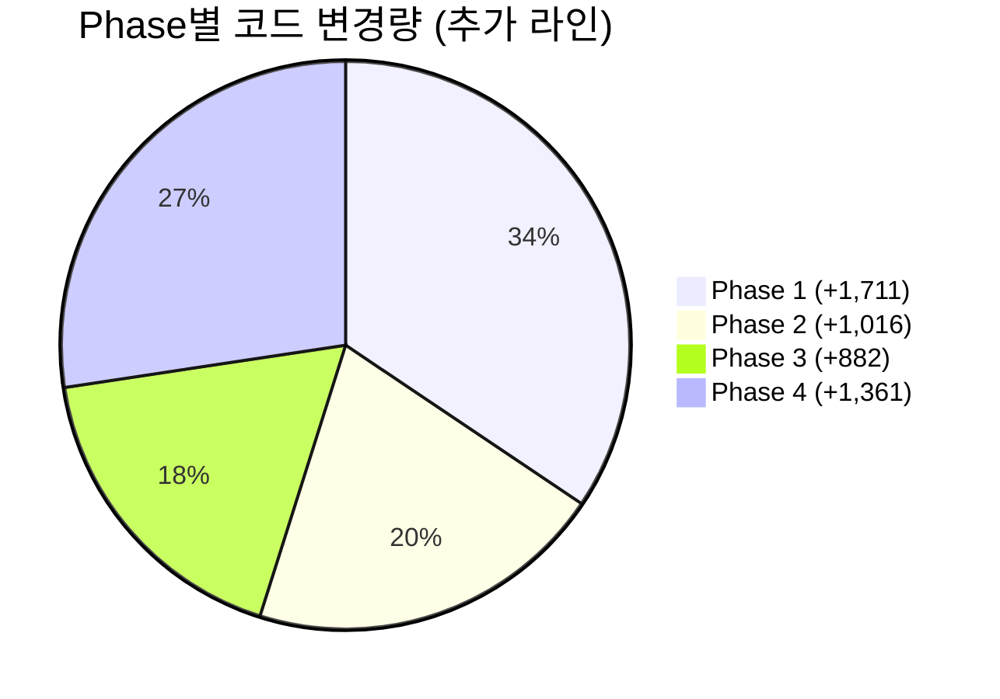
```mermaid
pie title Phase별 코드 변경량 (추가 라인)
    "Phase 1 (+1,711)" : 1711
    "Phase 2 (+1,016)" : 1016
    "Phase 3 (+882)" : 882
    "Phase 4 (+1,361)" : 1361
```

### 13.1 Phase 1: 기반 구축 + CDC 테스트 전체 구현

**범위**: 36 파일, +1,711 라인

| 구현 항목 | 설명 |
|---------|------|
| CFP 서비스 신규 구현 | ProposalStore, VoteStore, CfpController, 투표 기능 |
| 테스트 피라미드 구축 | Unit / Component / Integration / Contract 4계층 |
| Pact Consumer 테스트 | CFP→Session, CFP→Attendee, Attendee→Session 3쌍 |
| Pact Provider 테스트 | SessionService, AttendeeService Provider 검증 |
| collectPacts Gradle Task | 다수 Consumer 계약 파일 자동 통합 |
| Pact Broker 연동 | docker-compose.yml, PostgreSQL |

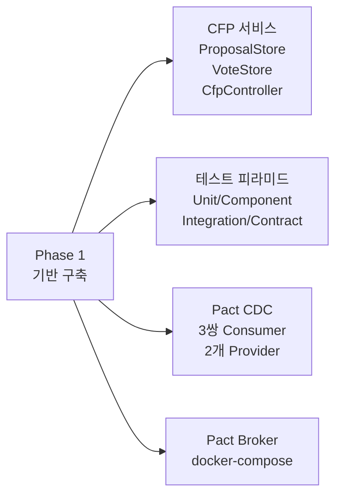
```mermaid
graph LR
    P1["Phase 1<br/>기반 구축"]
    P1 --> A["CFP 서비스<br/>ProposalStore<br/>VoteStore<br/>CfpController"]
    P1 --> B["테스트 피라미드<br/>Unit/Component<br/>Integration/Contract"]
    P1 --> C["Pact CDC<br/>3쌍 Consumer<br/>2개 Provider"]
    P1 --> D["Pact Broker<br/>docker-compose"]
```

### 13.2 Phase 2: Gateway + 보안 + API 설계 강화

**범위**: 38 파일, +1,016 라인

| 구현 항목 | 설명 |
|---------|------|
| API Gateway 도입 | Spring Cloud Gateway MVC, 5개 Route 설정 |
| DTO 분리 | CreateXRequest, UpdateXRequest, XResponse 패턴 전 서비스 적용 |
| RFC 7807 ProblemDetail | GlobalExceptionHandler, 표준 에러 응답 |
| JWT 인증 | JwtUtil (HMAC-SHA256), JwtAuthFilter, AuthController |
| RBAC | @RoleRequired, RoleCheckInterceptor, UserContext |
| OpenAPI 3.0 | Springdoc OpenAPI 2.3.0, 각 서비스 Swagger UI |
| ADR 문서화 | ADR-001 ~ ADR-006 |

```mermaid
graph LR
    P2["Phase 2<br/>보안 + Gateway"]
    P2 --> E["API Gateway<br/>라우팅/CORS<br/>Rate Limit"]
    P2 --> F["JWT + RBAC<br/>JwtAuthFilter<br/>RoleCheckInterceptor"]
    P2 --> G["DTO 분리<br/>RFC 7807<br/>Input Validation"]
    P2 --> H["OpenAPI 3.0<br/>Swagger UI"]
```

### 13.3 Phase 3: Feature Flag + DDD + Observability

**범위**: 26 파일, +882 라인

| 구현 항목 | 설명 |
|---------|------|
| Feature Flags | FeatureFlags ConfigurationProperties, 투표 알고리즘 분기 |
| DDD 문서화 | Bounded Context, Domain Event, Aggregate 설계 문서 |
| C4 모델 | Context / Container / Component 다이어그램 |
| 보안 아키텍처 문서 | 위협 모델, RBAC 설계, 보안 체크리스트 |
| Observability 구현 | Micrometer Prometheus, 커스텀 비즈니스 메트릭 |
| Grafana 대시보드 | 18개 패널, docker-compose.monitoring.yml |

```mermaid
graph LR
    P3["Phase 3<br/>Observability + DDD"]
    P3 --> I["Feature Flags<br/>ConfigurationProperties<br/>투표 알고리즘 분기"]
    P3 --> J["Observability<br/>Micrometer<br/>Prometheus<br/>Grafana"]
    P3 --> K["DDD / C4<br/>Bounded Context<br/>Domain Event"]
    P3 --> L["보안 문서<br/>위협 모델<br/>RBAC 설계"]
```

### 13.4 Phase 4: API Versioning + 인프라 + 성능 테스트

**범위**: 26 파일, +1,361 라인

| 구현 항목 | 설명 |
|---------|------|
| API Versioning | SessionV1Controller, SessionV2Controller (tags, capacity 추가) |
| SessionV2Dto | SessionV2Response (V2 확장 필드) |
| Dockerfile | 각 서비스 eclipse-temurin:21-jre-alpine 이미지 |
| Kubernetes manifests | Deployment + Service for 5 services |
| Istio Service Mesh | VirtualService, DestinationRule, PeerAuthentication, AuthorizationPolicy, FaultInjection |
| 성능 테스트 | performance-test/ 디렉토리 |
| 클라우드 마이그레이션 | 6R Strategy, Strangler Fig, Branch by Abstraction 문서 |

```mermaid
graph LR
    P4["Phase 4<br/>Infra + Versioning"]
    P4 --> M["API Versioning<br/>V1/V2 Controller<br/>SessionV2Dto"]
    P4 --> N["Docker / K8s<br/>Dockerfile<br/>Deployment/Service"]
    P4 --> O["Istio Service Mesh<br/>카나리 배포<br/>mTLS"]
    P4 --> P["성능 테스트<br/>클라우드 마이그레이션"]
```

### 13.5 전체 누적 통계

| 항목 | 수치 |
|------|------|
| 총 변경 파일 수 | 126 files |
| 총 추가 라인 수 | +4,970 lines |
| 마이크로서비스 수 | 4 (gateway + 3 services) |
| Pact 계약 쌍 수 | 3 쌍 (Consumer-Provider) |
| 테스트 클래스 수 | 13개 (Unit/Component/Integration/Contract) |
| ADR 수 | 6개 (ADR-001 ~ ADR-006) |
| Kubernetes 매니페스트 | 5개 Deployment + 5개 Service |
| Grafana 대시보드 패널 | 18개 |

---

## 참고자료

| 분류 | 항목 |
|------|------|
| 원서 | Mastering API Architecture - O'Reilly (2023) |
| Pact 공식 문서 | https://docs.pact.io |
| Pact JVM | https://github.com/pact-foundation/pact-jvm |
| Pact Broker | https://docs.pact.io/pact_broker |
| Spring Cloud Gateway MVC | https://docs.spring.io/spring-cloud-gateway/docs/current/reference/html/ |
| Springdoc OpenAPI | https://springdoc.org |
| Micrometer | https://micrometer.io |
| Istio | https://istio.io/docs |
| RFC 7807 (ProblemDetail) | https://www.rfc-editor.org/rfc/rfc7807 |
| RFC 7519 (JWT) | https://www.rfc-editor.org/rfc/rfc7519 |
