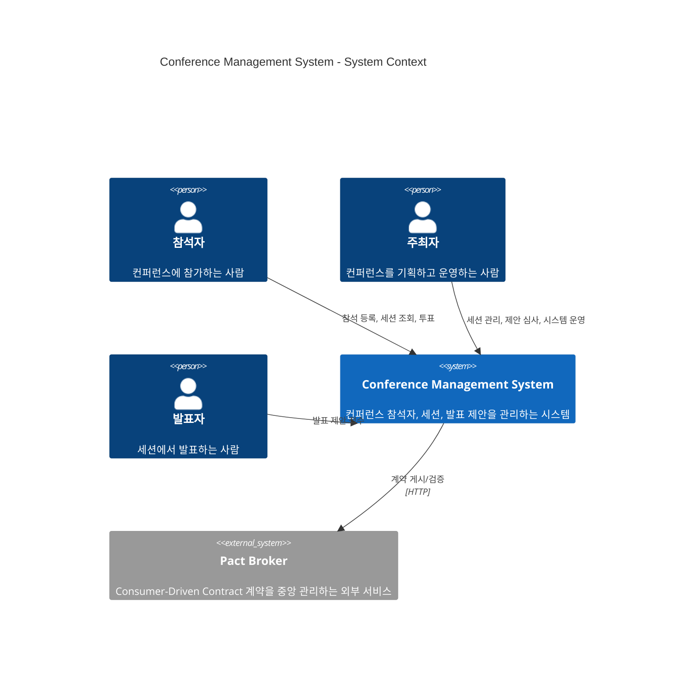

# C4 Level 1: System Context Diagram

## 시스템 컨텍스트

## 핵심 사용자

| 사용자 | 역할 | 주요 활동 |
|--------|------|----------|
| **참석자** (Attendee) | ATTENDEE | 등록, 세션 조회, 발표 제안 투표 |
| **주최자** (Organizer) | ORGANIZER | 세션 CRUD, 제안 승인/거부, 참석자 관리 |
| **발표자** (Speaker) | ATTENDEE | 발표 제안 접수 (참석자이기도 함) |

## 외부 시스템

| 시스템 | 역할 | 연동 방식 |
|--------|------|----------|
| **Pact Broker** | CDC 계약 중앙 관리 | HTTP (Docker Compose) |
| **PostgreSQL** | 데이터 영구 저장 (jpa 프로필) | JDBC |
