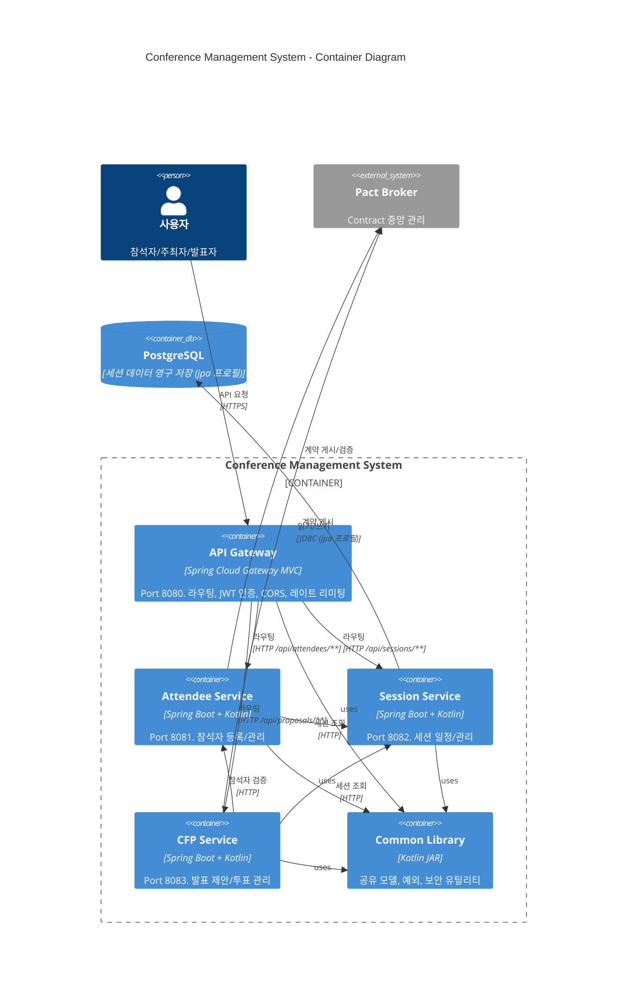

# C4 Level 2: Container Diagram

## 컨테이너 구성

## 컨테이너 상세

| Container | 기술 스택 | Port | 역할 |
|-----------|----------|------|------|
| **API Gateway** | Spring Cloud Gateway MVC | 8080 | 단일 진입점, 인증, 라우팅 |
| **Attendee Service** | Spring Boot 3.3.6 + Kotlin | 8081 | 참석자 CRUD |
| **Session Service** | Spring Boot 3.3.6 + Kotlin | 8082 | 세션 CRUD, JPA/인메모리 |
| **CFP Service** | Spring Boot 3.3.6 + Kotlin | 8083 | 제안/투표 관리 |
| **Common Library** | Kotlin JAR | - | Shared Kernel |

## 통신 프로토콜

모든 서비스 간 통신: **동기 HTTP/REST + JSON**

| From | To | 방식 | 용도 |
|------|----|------|------|
| Gateway → Services | HTTP Proxy | 요청 라우팅 |
| CFP → Attendee | RestClient | 발표자/투표자 검증 |
| CFP → Session | RestClient | 세션 정보 조회 |
| Attendee → Session | RestClient | 세션 목록 조회 |
