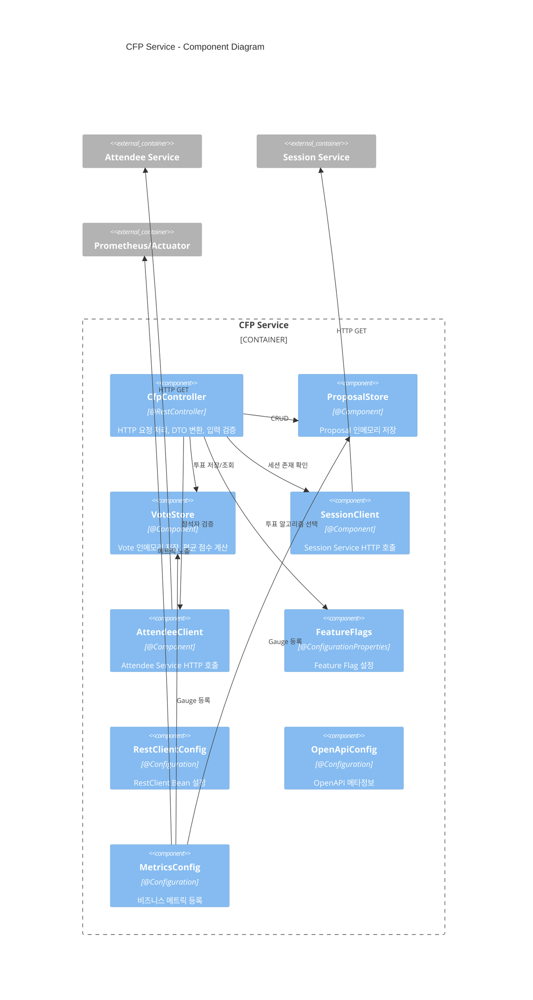
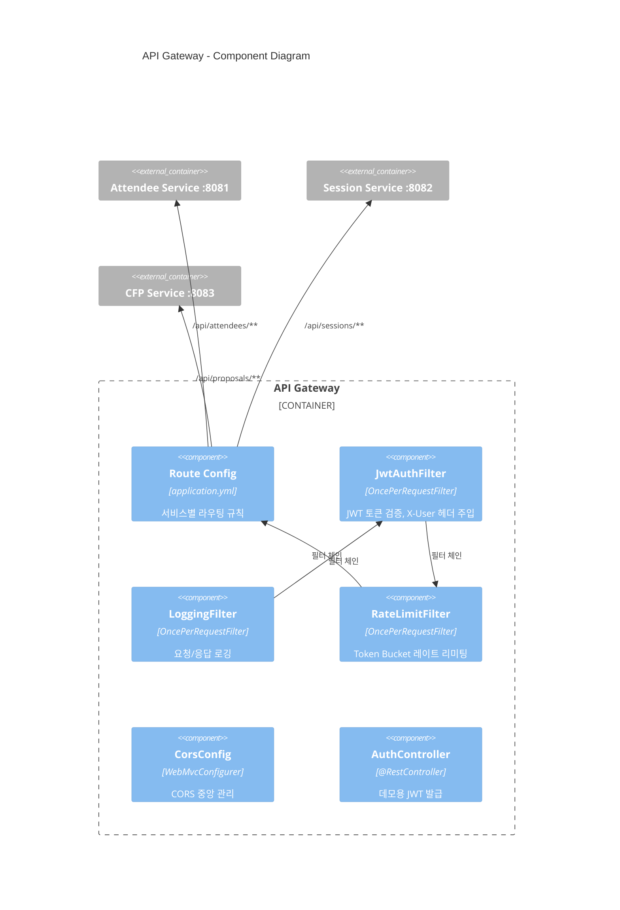
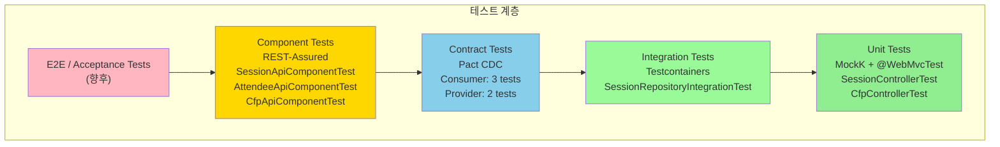

# C4 Level 3: Component Diagram

## CFP Service 컴포넌트 (가장 복잡한 서비스)

```mermaid
C4Component
    title CFP Service - Component Diagram

    Container_Boundary(cfp, "CFP Service") {
        Component(controller, "CfpController", "@RestController", "HTTP 요청 처리, DTO 변환, 입력 검증")
        Component(proposalStore, "ProposalStore", "@Component", "Proposal 인메모리 저장")
        Component(voteStore, "VoteStore", "@Component", "Vote 인메모리 저장, 평균 점수 계산")
        Component(sessionClient, "SessionClient", "@Component", "Session Service HTTP 호출")
        Component(attendeeClient, "AttendeeClient", "@Component", "Attendee Service HTTP 호출")
        Component(featureFlags, "FeatureFlags", "@ConfigurationProperties", "Feature Flag 설정")
        Component(restConfig, "RestClientConfig", "@Configuration", "RestClient Bean 설정")
        Component(openApi, "OpenApiConfig", "@Configuration", "OpenAPI 메타정보")
        Component(metrics, "MetricsConfig", "@Configuration", "비즈니스 메트릭 등록")
    }

    Container_Ext(attendeeSvc, "Attendee Service")
    Container_Ext(sessionSvc, "Session Service")
    Container_Ext(prometheus, "Prometheus/Actuator")

    Rel(controller, proposalStore, "CRUD")
    Rel(controller, voteStore, "투표 저장/조회")
    Rel(controller, sessionClient, "세션 존재 확인")
    Rel(controller, attendeeClient, "참석자 검증")
    Rel(controller, featureFlags, "투표 알고리즘 선택")
    Rel(sessionClient, sessionSvc, "HTTP GET")
    Rel(attendeeClient, attendeeSvc, "HTTP GET")
    Rel(metrics, proposalStore, "Gauge 등록")
    Rel(metrics, voteStore, "Gauge 등록")
    Rel(metrics, prometheus, "메트릭 노출")
```

## Gateway 컴포넌트

```mermaid
C4Component
    title API Gateway - Component Diagram

    Container_Boundary(gw, "API Gateway") {
        Component(routes, "Route Config", "application.yml", "서비스별 라우팅 규칙")
        Component(jwtFilter, "JwtAuthFilter", "OncePerRequestFilter", "JWT 토큰 검증, X-User 헤더 주입")
        Component(logFilter, "LoggingFilter", "OncePerRequestFilter", "요청/응답 로깅")
        Component(rateLimit, "RateLimitFilter", "OncePerRequestFilter", "Token Bucket 레이트 리미팅")
        Component(cors, "CorsConfig", "WebMvcConfigurer", "CORS 중앙 관리")
        Component(auth, "AuthController", "@RestController", "데모용 JWT 발급")
    }

    Container_Ext(attendee, "Attendee Service :8081")
    Container_Ext(session, "Session Service :8082")
    Container_Ext(cfp, "CFP Service :8083")

    Rel(logFilter, jwtFilter, "필터 체인")
    Rel(jwtFilter, rateLimit, "필터 체인")
    Rel(rateLimit, routes, "필터 체인")
    Rel(routes, attendee, "/api/attendees/**")
    Rel(routes, session, "/api/sessions/**")
    Rel(routes, cfp, "/api/proposals/**")
```

## 테스트 피라미드 컴포넌트

```mermaid
graph TB
    subgraph "테스트 계층"
        E2E["E2E / Acceptance Tests<br/>(향후)"]
        COMPONENT["Component Tests<br/>REST-Assured<br/>SessionApiComponentTest<br/>AttendeeApiComponentTest<br/>CfpApiComponentTest"]
        CONTRACT["Contract Tests<br/>Pact CDC<br/>Consumer: 3 tests<br/>Provider: 2 tests"]
        INTEGRATION["Integration Tests<br/>Testcontainers<br/>SessionRepositoryIntegrationTest"]
        UNIT["Unit Tests<br/>MockK + @WebMvcTest<br/>SessionControllerTest<br/>CfpControllerTest"]
    end

    E2E --> COMPONENT
    COMPONENT --> CONTRACT
    CONTRACT --> INTEGRATION
    INTEGRATION --> UNIT

    style UNIT fill:#90EE90
    style INTEGRATION fill:#98FB98
    style CONTRACT fill:#87CEEB
    style COMPONENT fill:#FFD700
    style E2E fill:#FFB6C1
```
