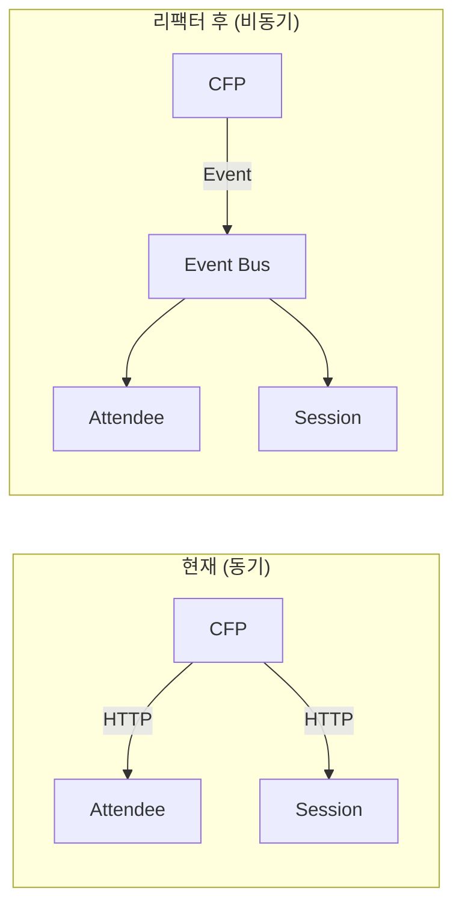

# 6R 전략 분석: 컨퍼런스 관리 시스템

## 개요

6R(6 Rs of Cloud Migration)은 애플리케이션을 클라우드로 마이그레이션할 때 사용하는 6가지 전략이다.

> **참고**: Mastering API Architecture, Ch9: 클라우드 마이그레이션

## 6R 전략

### 1. Rehost (리호스트, "Lift and Shift")

**정의**: 코드 변경 없이 인프라만 클라우드로 이전

**컨퍼런스 시스템 적용**:
- Docker 이미지를 그대로 AWS ECS/GKE에 배포
- application.yml의 서비스 URL만 클라우드 내부 주소로 변경
- 인메모리 저장소는 유지 (stateless 서비스)

**장점**: 빠른 이전, 코드 변경 없음
**단점**: 클라우드 네이티브 기능 미활용

```yaml
# 변경 예시: cfp-service application.yml
session-service:
  url: http://session-service.conference.svc.cluster.local:8082  # K8s 내부 DNS
attendee-service:
  url: http://attendee-service.conference.svc.cluster.local:8081
```

### 2. Replatform (리플랫폼, "Lift, Tinker, and Shift")

**정의**: 최소한의 변경으로 클라우드 관리형 서비스 활용

**컨퍼런스 시스템 적용**:
- PostgreSQL → AWS RDS / Cloud SQL
- 인메모리 저장소 → Redis (ElastiCache / Memorystore)
- Pact Broker → 관리형 Pact Broker (Pactflow)

**장점**: 관리 부담 감소, 가용성 향상
**단점**: 벤더 종속성 증가

```yaml
# 변경 예시: session-service application-cloud.yml
spring:
  datasource:
    url: jdbc:postgresql://conference-db.xxx.rds.amazonaws.com:5432/conference
  redis:
    host: conference-cache.xxx.cache.amazonaws.com
```

### 3. Repurchase (재구매, "Drop and Shop")

**정의**: 상용 SaaS 제품으로 대체

**컨퍼런스 시스템 적용**:
- 참석자 관리 → Eventbrite/Meetup API
- CFP → Sessionize/Papercall
- JWT 인증 → Auth0/Cognito

**장점**: 개발/운영 비용 절감
**단점**: 커스터마이징 제한, API 의존성

### 4. Refactor (리팩터, "Re-architect")

**정의**: 클라우드 네이티브 아키텍처로 재설계

**컨퍼런스 시스템 적용**:
- 동기 HTTP → 비동기 이벤트 기반 (Kafka/SNS+SQS)
- API Gateway → AWS API Gateway / Cloud Endpoints
- Feature Flag → LaunchDarkly / AWS AppConfig
- Observability → AWS X-Ray / Cloud Trace



### 5. Retire (퇴역)

**정의**: 더 이상 필요 없는 서비스 폐기

**컨퍼런스 시스템 적용**:
- 대시보드(삭제됨) — 이미 Phase 1에서 제거
- 레거시 API 엔드포인트 — v1 API의 단계적 폐기 계획

### 6. Retain (유지)

**정의**: 클라우드 이전 없이 온프레미스 유지

**컨퍼런스 시스템 적용**:
- 민감 데이터 처리 서비스 (규제 요건)
- 특수 하드웨어 의존 서비스

## 권장 전략

| 단계 | 전략 | 대상 | 효과 |
|------|------|------|------|
| 1단계 | **Rehost** | 전체 서비스 | 빠른 클라우드 이전 |
| 2단계 | **Replatform** | DB, Cache, Auth | 운영 부담 감소 |
| 3단계 | **Refactor** | 이벤트 기반 전환 | 확장성/복원력 향상 |
