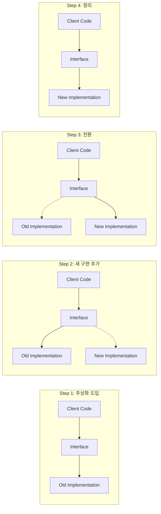

# Branch by Abstraction

## 개요

Branch by Abstraction은 대규모 코드 변경을 안전하게 수행하기 위한 패턴이다. 기존 구현과 새 구현을 추상화 레이어 뒤에 두고 점진적으로 전환한다.

> **참고**: Mastering API Architecture, Ch9: 진화적 아키텍처
> **원저**: Paul Hammant, "Branch by Abstraction" (2007)

## 패턴 원리



## 컨퍼런스 시스템 적용: SessionStore 전환 사례

현재 프로젝트에서 이미 Branch by Abstraction이 적용된 사례:

### Step 1: 추상화 도입 — SessionStoreInterface

```kotlin
// 추상화 인터페이스
interface SessionStoreInterface {
    fun getAllSessions(): List<Session>
    fun getSession(id: Int): Session?
    fun addSession(session: Session): Session
    fun updateSession(id: Int, session: Session): Session?
    fun removeSession(id: Int): Boolean
    fun clear()
}
```

### Step 2: 기존 구현 유지 — InMemory SessionStore

```kotlin
@Component
@Profile("default")  // 기본 프로필에서만 활성화
class SessionStore : SessionStoreInterface {
    private val sessions = ConcurrentHashMap<Int, Session>()
    // ... ConcurrentHashMap 기반 구현
}
```

### Step 3: 새 구현 추가 — JPA SessionStore

```kotlin
@Component
@Profile("jpa")  // jpa 프로필에서만 활성화
class JpaSessionStore(
    private val repository: SessionJpaRepository
) : SessionStoreInterface {
    // ... Spring Data JPA 기반 구현
}
```

### Step 4: Controller는 추상화에만 의존

```kotlin
@RestController
class SessionController(
    private val sessionStore: SessionStoreInterface  // 인터페이스만 의존
) {
    // 구현체에 대한 지식 없음
}
```

### 전환 방법

```bash
# 인메모리 (기본)
./gradlew :session-service:bootRun

# JPA + PostgreSQL
./gradlew :session-service:bootRun --args='--spring.profiles.active=jpa'
```

## Feature Flag와의 조합

Branch by Abstraction + Feature Flag = 런타임 전환:

```kotlin
// 현재 프로젝트의 Feature Flag 적용 사례
@GetMapping("/{id}/votes")
fun getVotes(@PathVariable id: Int): ResponseEntity<VoteSummaryResponse> {
    val averageScore = if (featureFlags.newVotingAlgorithm) {
        voteStore.getWeightedAverageScore(id)  // 새 알고리즘
    } else {
        voteStore.getAverageScore(id)           // 기존 알고리즘
    }
    // ...
}
```

## 적용 판단 기준

| 상황 | Branch by Abstraction | Feature Branch |
|------|----------------------|----------------|
| 대규모 리팩토링 | O | X (장기 브랜치 위험) |
| 저장소 교체 | O | X |
| 알고리즘 전환 | O (Feature Flag 조합) | O |
| 작은 버그 수정 | X (과잉 설계) | O |
| 외부 API 교체 | O (ACL 패턴 조합) | X |
