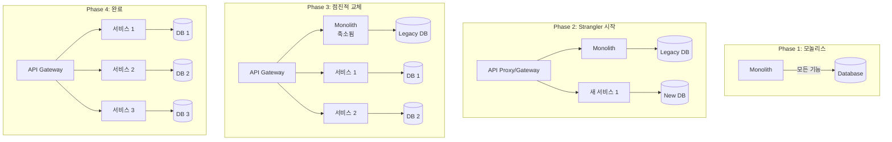

# Strangler Fig 패턴

## 개요

Strangler Fig(교살자 무화과) 패턴은 레거시 모놀리식 시스템을 점진적으로 마이크로서비스로 교체하는 전략이다.

> **참고**: Mastering API Architecture, Ch9: 진화적 아키텍처
> **원저**: Martin Fowler, "StranglerFigApplication" (2004)

## 패턴 원리



## 컨퍼런스 시스템 적용 시나리오

가상의 레거시 모놀리스에서 현재 마이크로서비스로 전환하는 과정:

### Phase 1: 모놀리스 상태
```
ConferenceMonolith (Spring MVC)
├── /attendees    → AttendeeModule
├── /sessions     → SessionModule
├── /proposals    → CfpModule
└── Database      → 단일 PostgreSQL
```

### Phase 2: Gateway 도입 + 첫 번째 서비스 추출
```
Gateway (Spring Cloud Gateway MVC, port 8080)
├── /api/sessions/**   → session-service (신규, port 8082)
├── /api/attendees/**  → ConferenceMonolith (기존)
└── /api/proposals/**  → ConferenceMonolith (기존)
```

**핵심**: Gateway가 라우팅을 제어하므로 클라이언트는 변경을 인지하지 못함

### Phase 3: 두 번째 서비스 추출
```
Gateway
├── /api/sessions/**   → session-service
├── /api/attendees/**  → attendee-service (신규, port 8081)
└── /api/proposals/**  → ConferenceMonolith (축소됨)
```

Pact CDC로 session-service와 attendee-service 간 계약 검증

### Phase 4: 모놀리스 완전 교체
```
Gateway
├── /api/sessions/**   → session-service
├── /api/attendees/**  → attendee-service
└── /api/proposals/**  → cfp-service (신규, port 8083)
```

모놀리스 퇴역 완료. 현재 시스템 구조와 동일.

## 핵심 원칙

1. **점진적 교체**: 한 번에 하나의 Bounded Context만 추출
2. **Gateway 활용**: 라우팅 변경으로 클라이언트 영향 최소화
3. **CDC 테스트**: 추출된 서비스 간 계약 검증으로 안전성 보장
4. **롤백 가능**: Gateway 라우팅만 변경하면 이전 모놀리스로 복귀 가능

## Anti-Patterns

| Anti-Pattern | 설명 | 대안 |
|-------------|------|------|
| Big Bang 전환 | 한 번에 모든 기능 교체 | 점진적 추출 |
| 데이터 공유 | 마이크로서비스가 모놀리스 DB 직접 접근 | API 기반 통신 |
| 무분별한 분할 | 너무 작은 서비스로 분할 | Bounded Context 기반 |
