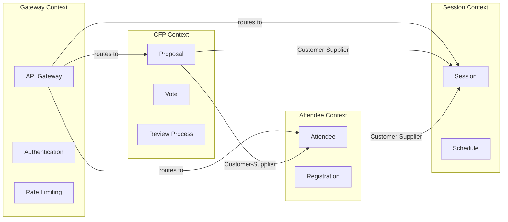
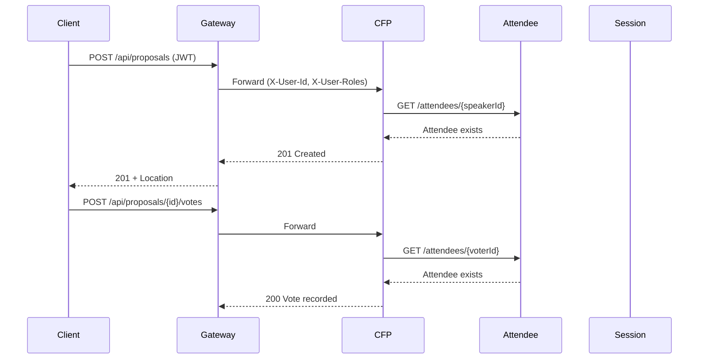

# Bounded Context Map

## 컨퍼런스 관리 시스템

### Bounded Contexts

### Context 설명

| Context | 책임 | 핵심 엔티티 | 소유 팀 |
|---------|------|------------|---------|
| **Attendee** | 참석자 등록, 프로필 관리 | Attendee | 참석자 팀 |
| **Session** | 세션 일정, 발표 관리 | Session | 프로그램 팀 |
| **CFP** | 발표 제안 접수, 투표, 리뷰 | Proposal, Vote | CFP 팀 |
| **Gateway** | API 진입점, 인증, 라우팅 | - | 플랫폼 팀 |

### Context 간 관계

| Upstream | Downstream | 패턴 | 설명 |
|----------|-----------|------|------|
| Session | Attendee | Customer-Supplier | Attendee가 Session 목록 조회 |
| Session | CFP | Customer-Supplier | CFP가 승인된 Proposal의 Session 연결 |
| Attendee | CFP | Customer-Supplier | CFP가 발표자/투표자 검증 |

### 데이터 흐름

