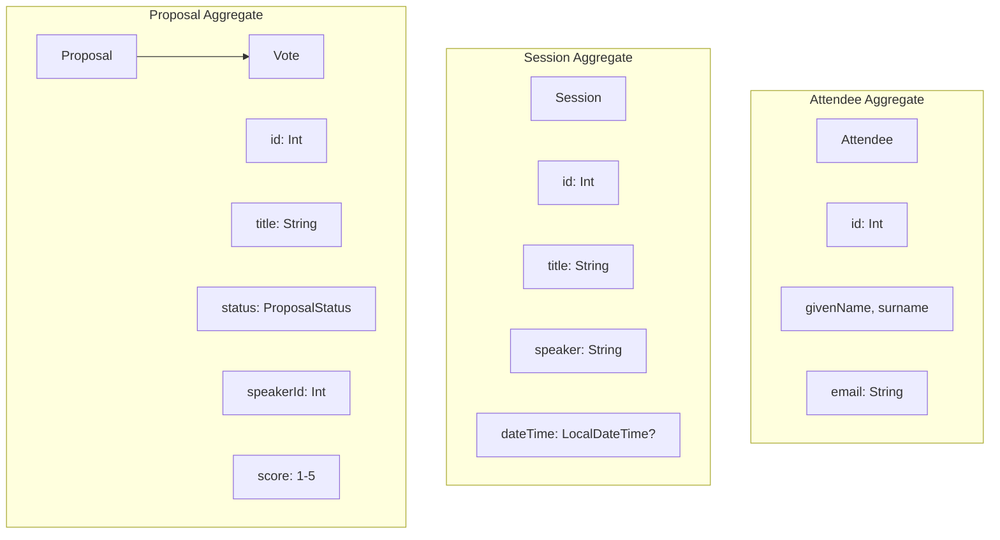

# Event Storming 결과

## 세션 개요
- **대상**: 컨퍼런스 관리 시스템
- **참여자**: 도메인 전문가, 개발팀
- **방법론**: Big Picture Event Storming → Design Level Event Storming

## Domain Events (주황색)

### Attendee Context
1. `AttendeeRegistered` — 참석자가 등록됨
2. `AttendeeUpdated` — 참석자 정보가 수정됨
3. `AttendeeRemoved` — 참석자가 삭제됨

### Session Context
4. `SessionCreated` — 세션이 생성됨
5. `SessionUpdated` — 세션 정보가 수정됨
6. `SessionCancelled` — 세션이 취소됨

### CFP Context
7. `ProposalSubmitted` — 발표 제안이 접수됨
8. `ProposalReviewed` — 발표 제안이 리뷰됨
9. `ProposalApproved` — 발표 제안이 승인됨
10. `ProposalRejected` — 발표 제안이 거부됨
11. `VoteCast` — 투표가 진행됨

## Commands (파란색)

| Command | Actor | Event | Aggregate |
|---------|-------|-------|-----------|
| RegisterAttendee | 참석자 | AttendeeRegistered | Attendee |
| UpdateAttendee | 참석자 | AttendeeUpdated | Attendee |
| CreateSession | 주최자 | SessionCreated | Session |
| UpdateSession | 주최자 | SessionUpdated | Session |
| SubmitProposal | 발표자 | ProposalSubmitted | Proposal |
| ReviewProposal | 심사위원 | ProposalReviewed | Proposal |
| ApproveProposal | 주최자 | ProposalApproved | Proposal |
| RejectProposal | 주최자 | ProposalRejected | Proposal |
| CastVote | 참석자 | VoteCast | Vote |

## Aggregates (노란색)

## Policies (보라색, 자동 규칙)

| Policy | Trigger Event | Action |
|--------|--------------|--------|
| 발표자 검증 | ProposalSubmitted | AttendeeService에서 speakerId 존재 확인 |
| 투표자 검증 | VoteCast | AttendeeService에서 attendeeId 존재 확인 |
| 세션 연결 | ProposalApproved | SessionService에서 sessionId 연결 |

## Read Models (녹색)

| Read Model | 데이터 소스 | 용도 |
|------------|-----------|------|
| 참석자 목록 | AttendeeStore | 참석자 관리 화면 |
| 세션 일정표 | SessionStore | 컨퍼런스 프로그램 |
| 제안 현황판 | ProposalStore + VoteStore | CFP 심사 대시보드 |

## Hot Spots (분홍색, 해결 필요)

1. **동시 투표**: 같은 제안에 동시 투표 시 정합성 → ConcurrentHashMap으로 해결
2. **교차 컨텍스트 검증**: 발표자/투표자 검증 시 네트워크 지연 → 타임아웃 설정 (5s/10s)
3. **데이터 일관성**: 참석자 삭제 시 관련 제안의 speakerId 무효화 → 현재 미처리 (향후 이벤트 기반으로)
