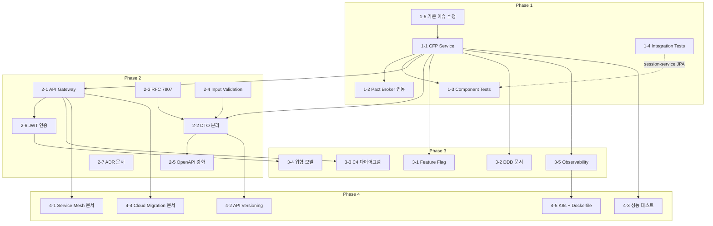

# pact-conference-demo 누락 기능 구현 계획서

> **작성일**: 2026-06-05
> **대상**: pact-conference-demo 프로젝트
> **목표**: Mastering API Architecture 책의 핵심 주제를 교육/데모 수준으로 구현
> **참조**: [GAP_ANALYSIS.md](./GAP_ANALYSIS.md)

---

## 1. 프로젝트 개요

### 현재 상태
- 2개 서비스 (attendee-service, session-service) + common 모듈
- Pact CDC 계약 테스트 구현 완료
- Docker Compose (Pact Broker 인프라만)
- 챕터 커버리지: ~11%

### 최종 목표
- 책의 핵심 주제를 코드/설정/문서로 시연 가능한 완성도 있는 데모 프로젝트
- 컨퍼런스 발표에서 각 챕터 주제를 실행 가능한 코드로 보여줄 수 있는 수준
- 목표 커버리지: 70%+ (인프라 의존 주제 제외)

---

## 2. Phase별 구현 계획

---

### Phase 1: 핵심 서비스 및 테스트 보강 (CRITICAL)

> **목표**: 책의 컨퍼런스 시스템 3대 서비스를 완성하고, 테스트 피라미드 전 계층을 구현한다

#### 1-1. CFP (Call for Papers) 서비스

**구현 범위**:
- CFP 서비스는 발표 제안 접수, 투표, 리뷰를 담당하는 세 번째 마이크로서비스
- Consumer로서 Session Service와 Attendee Service를 호출
- 3방향 Pact CDC 관계를 시연

**모듈 구조**:
```
cfp-service/
├── build.gradle.kts
├── src/main/kotlin/com/conference/cfp/
│   ├── CfpServiceApplication.kt
│   ├── controller/
│   │   └── CfpController.kt        # /proposals, /votes CRUD
│   ├── client/
│   │   ├── SessionClient.kt        # Session Service 호출
│   │   └── AttendeeClient.kt       # Attendee Service 호출
│   ├── model/
│   │   ├── Proposal.kt             # 발표 제안 (title, abstract, speakerId, sessionId)
│   │   └── Vote.kt                 # 투표 (proposalId, attendeeId, score)
│   └── store/
│       ├── ProposalStore.kt         # ConcurrentHashMap 저장
│       └── VoteStore.kt
├── src/main/resources/
│   └── application.yml              # port: 8082
└── src/test/kotlin/com/conference/cfp/
    ├── pact/
    │   ├── SessionServiceConsumerPactTest.kt   # CFP→Session 계약
    │   └── AttendeeServiceConsumerPactTest.kt  # CFP→Attendee 계약
    └── controller/
        └── CfpControllerTest.kt     # 단위 테스트
```

**Pact 계약 관계**:
```
AttendeeService ──Consumer──▶ SessionService (기존)
CfpService ──Consumer──▶ SessionService (신규)
CfpService ──Consumer──▶ AttendeeService (신규)
```

**API 엔드포인트**:
| Method | Path | 설명 |
|--------|------|------|
| GET | /proposals | 전체 제안 목록 |
| GET | /proposals/{id} | 제안 상세 |
| POST | /proposals | 제안 등록 (speakerId로 Attendee 검증) |
| PUT | /proposals/{id} | 제안 수정 |
| DELETE | /proposals/{id} | 제안 삭제 |
| POST | /proposals/{id}/votes | 투표 (attendeeId 검증) |
| GET | /proposals/{id}/votes | 투표 결과 조회 |

**기술 스택**: Spring Boot 3.3.6, Pact Consumer 4.6.14, Kotlin

**의존성**: settings.gradle.kts에 `include("cfp-service")` 추가 필요

---

#### 1-2. Pact Broker 실제 연동

**구현 범위**:
- `@PactFolder` → `@PactBroker` 전환
- Gradle `pactPublish` task 설정
- Consumer 테스트 후 자동 Broker 게시
- Provider 테스트에서 Broker에서 계약 fetch

**변경 파일**:
```
# Consumer 측 (attendee-service, cfp-service)
build.gradle.kts                          # pact.publish 블록 추가

# Provider 측 (session-service, attendee-service)
SessionServiceProviderPactTest.kt         # @PactFolder → @PactBroker
AttendeeServiceProviderPactTest.kt        # 신규 (CFP가 Consumer인 계약 검증)
```

**Gradle 설정 예시**:
```kotlin
pact {
    publish {
        pactBrokerUrl = "http://localhost:9292"
        pactBrokerUsername = System.getenv("PACT_BROKER_USERNAME") ?: "pact"
        pactBrokerPassword = System.getenv("PACT_BROKER_PASSWORD") ?: "pact"
        consumerVersion = project.version.toString()
    }
}
```

**성공 기준**:
- `./gradlew :attendee-service:pactPublish` 후 Pact Broker UI에서 계약 확인
- `@PactBroker`로 Provider 테스트 pass
- `docker compose exec pact-broker pact-broker can-i-deploy` 실행 가능

---

#### 1-3. 컴포넌트 테스트 추가

**구현 범위**:
- REST-Assured 스타일의 given-when-then HTTP 테스트
- `@SpringBootTest(RANDOM_PORT)` + 전체 Spring Context
- 외부 의존성만 Mock (SessionClient 등)

**신규 파일**:
```
session-service/src/test/kotlin/.../component/
    └── SessionApiComponentTest.kt      # 5+ 시나리오
attendee-service/src/test/kotlin/.../component/
    └── AttendeeApiComponentTest.kt     # 5+ 시나리오
cfp-service/src/test/kotlin/.../component/
    └── CfpApiComponentTest.kt          # 5+ 시나리오
```

**테스트 시나리오** (SessionApiComponentTest 예시):
- 세션 목록 조회 → 200 + ApiResponse 형식 검증
- 존재하는 세션 단건 조회 → 200 + JSON 필드 검증
- 존재하지 않는 세션 조회 → 404 + ProblemDetail 형식
- 세션 생성 → 201 + Location 헤더 + 생성된 리소스 검증
- 필수 필드 누락 생성 → 400 (Phase 2 Input Validation 후)

**의존성 추가**:
```kotlin
testImplementation("io.rest-assured:rest-assured:5.4.0")
testImplementation("io.rest-assured:kotlin-extensions:5.4.0")
```

---

#### 1-4. 통합 테스트 (Testcontainers)

**구현 범위**:
- 최소 1개 서비스(session-service)에 JPA + PostgreSQL 지원 추가
- 기존 인메모리 Store와 JPA Store를 Profile로 분리
- Testcontainers로 PostgreSQL 컨테이너 자동 시작/종료

**신규/변경 파일**:
```
session-service/
├── build.gradle.kts                      # JPA, PostgreSQL, Testcontainers 의존성 추가
├── src/main/kotlin/.../store/
│   ├── SessionStore.kt                   # 기존 인메모리 (profile: default)
│   └── JpaSessionStore.kt               # JPA 구현 (profile: jpa)
├── src/main/kotlin/.../entity/
│   └── SessionEntity.kt                 # JPA 엔티티
├── src/main/kotlin/.../repository/
│   └── SessionRepository.kt             # Spring Data JPA
├── src/main/resources/
│   ├── application.yml                   # 기본 (인메모리)
│   └── application-jpa.yml              # JPA + PostgreSQL
└── src/test/kotlin/.../integration/
    └── SessionRepositoryIntegrationTest.kt  # Testcontainers 테스트
```

**의존성 추가**:
```kotlin
implementation("org.springframework.boot:spring-boot-starter-data-jpa")
runtimeOnly("org.postgresql:postgresql")
testImplementation("org.testcontainers:junit-jupiter:1.19.3")
testImplementation("org.testcontainers:postgresql:1.19.3")
```

**성공 기준**: `./gradlew :session-service:test` 시 Testcontainers가 PostgreSQL을 자동 기동하고 통합 테스트 pass

---

#### 1-5. 기존 이슈 수정

| 이슈 | 수정 내용 |
|------|----------|
| AttendeeController Location 헤더 누락 | POST 응답에 `Location` 헤더 추가 |
| AttendeeStore clear() 미구현 | `clear()` 메서드 추가 |
| attendee-service 불필요 Provider 의존성 | `pact.provider:*` 의존성 제거 (CFP Consumer 계약 검증용 Provider 테스트 추가 시 다시 추가) |
| Pact nullable 필드 미커버 | `description: null` 시나리오 Pact interaction 추가 |

---

### Phase 2: API 설계 및 아키텍처 (HIGH)

> **목표**: 책 Part 1-3의 API 설계 원칙과 보안 기초를 구현한다

#### 2-1. API Gateway

**구현 범위**:
- Spring Cloud Gateway MVC 모듈 추가
- 3개 서비스로 라우팅
- 요청 로깅, 레이트 리미팅
- CORS 중앙 관리 (개별 Controller에서 제거)

**모듈 구조**:
```
gateway/
├── build.gradle.kts
├── src/main/kotlin/com/conference/gateway/
│   ├── GatewayApplication.kt
│   ├── config/
│   │   ├── RouteConfig.kt          # 라우팅 규칙
│   │   ├── RateLimitConfig.kt      # 레이트 리미팅
│   │   └── CorsConfig.kt           # CORS 중앙 관리
│   └── filter/
│       ├── LoggingFilter.kt        # 요청/응답 로깅
│       └── JwtAuthFilter.kt        # JWT 검증 (Phase 2-6과 연계)
├── src/main/resources/
│   └── application.yml             # port: 8080, routes 설정
└── src/test/kotlin/.../
    └── RouteTest.kt
```

**라우팅 규칙**:
```yaml
spring:
  cloud:
    gateway:
      routes:
        - id: attendee-service
          uri: http://localhost:8081
          predicates:
            - Path=/api/attendees/**
        - id: session-service
          uri: http://localhost:8082
          predicates:
            - Path=/api/sessions/**
        - id: cfp-service
          uri: http://localhost:8083
          predicates:
            - Path=/api/proposals/**,/api/votes/**
```

**포트 재배치** (Gateway가 8080을 차지):
- gateway: 8080
- attendee-service: 8081
- session-service: 8082
- cfp-service: 8083

---

#### 2-2. DTO 분리 + Mapper

**구현 범위**:
- 각 서비스에 Request/Response DTO 추가
- Mapper 함수로 도메인 모델 ↔ DTO 변환
- API 응답에서 도메인 모델 직접 노출 제거

**파일 구조** (session-service 예시):
```
session-service/src/main/kotlin/.../dto/
├── SessionResponse.kt              # API 응답 DTO
├── CreateSessionRequest.kt         # 생성 요청 DTO (@Valid 포함)
├── UpdateSessionRequest.kt         # 수정 요청 DTO
└── SessionMapper.kt                # Session ↔ DTO 변환
```

---

#### 2-3. RFC 7807 Problem Details 에러 응답

**구현 범위**:
- Spring 6의 `ProblemDetail` 클래스 활용
- `GlobalExceptionHandler` 전면 교체
- `application/problem+json` Content-Type 사용

**변경 파일**: `common/src/main/kotlin/.../exception/GlobalExceptionHandler.kt`

**에러 응답 예시**:
```json
{
  "type": "https://conference.example.com/errors/not-found",
  "title": "Session Not Found",
  "status": 404,
  "detail": "ID 999인 세션을 찾을 수 없습니다",
  "instance": "/api/sessions/999"
}
```

---

#### 2-4. 입력 검증 (Jakarta Bean Validation)

**구현 범위**:
- Request DTO에 `@NotBlank`, `@Email`, `@Size` 등 추가
- Controller 파라미터에 `@Valid` 적용
- MethodArgumentNotValidException 핸들링

**의존성**: `spring-boot-starter-validation` (이미 starter-web에 포함될 수 있으나 명시적 추가)

**예시**:
```kotlin
data class CreateSessionRequest(
    @field:NotBlank(message = "제목은 필수입니다")
    val title: String,

    @field:NotBlank(message = "발표자는 필수입니다")
    val speaker: String,

    @field:Size(max = 500, message = "설명은 500자 이하여야 합니다")
    val description: String? = null,

    val dateTime: LocalDateTime? = null
)
```

---

#### 2-5. OpenAPI 명세 강화

**구현 범위**:
- Controller에 `@Operation`, `@ApiResponse`, `@Schema` 어노테이션 추가
- ProblemDetail 에러 응답 스키마 정의
- API 그룹 설정 (springdoc grouping)

---

#### 2-6. JWT 인증/인가

**구현 범위**:
- 자체 JWT 발급 유틸리티 (테스트/데모용, 실제 IdP 없음)
- Gateway의 JwtAuthFilter에서 토큰 검증
- X-User-Id, X-User-Roles 헤더로 하위 서비스에 전달
- RBAC 시연: ATTENDEE 역할은 읽기만, ORGANIZER는 쓰기 가능

**신규 파일**:
```
common/src/main/kotlin/.../security/
├── JwtUtil.kt                  # 토큰 생성/검증 유틸리티
├── UserContext.kt              # 현재 사용자 정보 (X-User-* 헤더 기반)
└── RoleRequired.kt             # 커스텀 어노테이션 (@RoleRequired("ORGANIZER"))
```

---

#### 2-7. ADR 문서

**구현 범위**: 핵심 아키텍처 결정을 ADR 형식으로 문서화

**신규 파일**:
```
docs/adr/
├── ADR-001-서비스-분리.md
├── ADR-002-pact-cdc-선택.md
├── ADR-003-인메모리-저장소.md
├── ADR-004-spring-cloud-gateway.md
├── ADR-005-jwt-자체-발급.md
└── ADR-006-shared-kernel-common-모듈.md
```

---

### Phase 3: 보안, DDD, 관측성 (MEDIUM)

> **목표**: 책 Part 3의 보안/DDD 주제를 문서와 간단한 코드로 시연한다

#### 3-1. Feature Flag 데모

**구현 범위**:
- `application.yml`의 property 기반 간이 Feature Flag
- `FeatureFlagService` 컴포넌트
- CFP 서비스에 "new-voting-algorithm" 플래그 적용

```kotlin
@ConfigurationProperties(prefix = "features")
data class FeatureFlags(
    val newVotingAlgorithm: Boolean = false,
    val detailedLogging: Boolean = false,
)
```

---

#### 3-2. DDD 문서화

**신규 파일**:
```
docs/ddd/
├── BOUNDED_CONTEXT_MAP.md       # Mermaid 다이어그램
├── CONTEXT_MAPPING_PATTERNS.md  # ACL, OHS, Shared Kernel 패턴 분석
├── EVENT_STORMING_RESULT.md     # 이벤트 스토밍 결과
└── UBIQUITOUS_LANGUAGE.md       # 도메인 용어 사전
```

---

#### 3-3. C4 다이어그램

**신규 파일**:
```
docs/c4/
├── C4_LEVEL1_CONTEXT.md         # 시스템 컨텍스트
├── C4_LEVEL2_CONTAINER.md       # 컨테이너 (서비스 단위)
└── C4_LEVEL3_COMPONENT.md       # 컴포넌트 (모듈 내부)
```

---

#### 3-4. 위협 모델 문서

**신규 파일**:
```
docs/security/
├── THREAT_MODEL.md              # DFD + STRIDE 분석
└── OWASP_API_CHECKLIST.md       # OWASP API Security Top 10 체크리스트
```

---

#### 3-5. Observability

**구현 범위**:
- Spring Boot Actuator 추가 (health, info, metrics 엔드포인트)
- Micrometer Prometheus 메트릭 export
- 커스텀 비즈니스 메트릭 (등록 수, 투표 수)

**의존성 추가** (전 서비스):
```kotlin
implementation("org.springframework.boot:spring-boot-starter-actuator")
runtimeOnly("io.micrometer:micrometer-registry-prometheus")
```

**application.yml 추가**:
```yaml
management:
  endpoints:
    web:
      exposure:
        include: health,info,metrics,prometheus
  endpoint:
    health:
      show-details: always
```

---

### Phase 4: 인프라 및 문서 보강 (LOW)

> **목표**: 인프라 의존 주제를 문서/설정 파일로 시연한다

#### 4-1. 서비스 메시 YAML 예시

```
docs/service-mesh/
├── README.md                    # 서비스 메시 개념 설명
├── virtual-service.yaml         # 카나리 배포 설정
├── destination-rule.yaml        # 서킷 브레이커 설정
├── peer-authentication.yaml     # mTLS 설정
├── authorization-policy.yaml    # 서비스 간 인가
└── fault-injection.yaml         # 장애 주입
```

#### 4-2. API 버전 관리 데모

- session-service에 `/v1/sessions`, `/v2/sessions` 경로 추가
- v2에서 응답 필드 추가 (비파괴적 변경 시연)

#### 4-3. 성능 테스트

- Gatling Gradle 플러그인 + Scala DSL 시뮬레이션 1개
- `./gradlew gatlingRun`으로 실행 가능

#### 4-4. 클라우드 마이그레이션 문서

```
docs/cloud-migration/
├── 6R_STRATEGY.md               # 6R 전략 분석
├── STRANGLER_FIG.md             # Strangler Fig 패턴 적용 시나리오
└── BRANCH_BY_ABSTRACTION.md     # 코드 예시 포함
```

#### 4-5. Kubernetes 매니페스트 + Dockerfile

```
k8s/
├── session-service-deployment.yaml
├── attendee-service-deployment.yaml
├── cfp-service-deployment.yaml
├── gateway-deployment.yaml
└── pact-broker-deployment.yaml

Dockerfile (각 서비스 루트)
├── session-service/Dockerfile
├── attendee-service/Dockerfile
├── cfp-service/Dockerfile
└── gateway/Dockerfile
```

---

## 3. 우선순위 근거

| Phase | 우선순위 근거 |
|-------|-------------|
| **Phase 1** | 책 전체를 관통하는 컨퍼런스 시스템의 **3대 서비스 완성**이 최우선. CFP 없이는 다자간 CDC, DDD Bounded Context, 서비스 간 인증 등을 시연할 수 없다. 테스트 피라미드 보완은 Ch2의 핵심 주제이며 Pact Broker 연동은 CDC의 본래 가치를 보여주는 데 필수. |
| **Phase 2** | API 설계 품질(DTO, 검증, 에러 표준)과 인프라(Gateway, JWT)는 책의 **실무 적용 핵심 주제**. Phase 1의 서비스가 있어야 Gateway 라우팅, JWT 인증을 의미있게 시연할 수 있다. |
| **Phase 3** | 보안/DDD/관측성은 **문서 중심**으로 충분한 교육 가치를 제공. 코드 구현보다 개념 이해와 설계 결정이 중요한 영역이므로, Phase 1-2 완료 후 문서화에 집중. |
| **Phase 4** | 인프라 의존 주제(K8s, Istio, Gatling)는 로컬 데모에서 실행이 어렵거나 부차적. **설정 파일 예시와 문서**로 개념 전달이 가능. |

---

## 4. 기술적 제약사항

| 제약 | 영향 | 대응 |
|------|------|------|
| K8s 클러스터 없음 | 서비스 메시(Istio) 실행 불가 | YAML 예시 문서로 대체 |
| 실제 IdP 없음 | OAuth 2.0/OIDC 플로우 미구현 | 자체 JWT 발급 유틸리티로 시뮬레이션 |
| Docker 리소스 제한 | 과도한 컨테이너 부하 | 필수 인프라만 docker-compose, 서비스는 Gradle로 직접 실행 |
| 데모/학습 프로젝트 | 프로덕션 수준 불필요 | 개념 시연에 충분한 최소 구현 유지 |
| Kotlin 기반 | Java 예시를 Kotlin으로 변환 필요 | Kotlin 관용적 코드 사용 |

---

## 5. 성공 기준

### Phase 1 완료 기준
- [ ] CFP 서비스가 독립 모듈로 빌드/실행 가능
- [ ] 3방향 Pact 계약이 모두 pass (`AttendeeService→SessionService`, `CfpService→SessionService`, `CfpService→AttendeeService`)
- [ ] Pact Broker UI에서 3개 Consumer-Provider 관계가 모두 표시
- [ ] REST-Assured 컴포넌트 테스트가 각 서비스에 5건+ 존재하고 pass
- [ ] Testcontainers 통합 테스트가 session-service에서 PostgreSQL과 함께 pass
- [ ] `./gradlew test` 전체 pass (기존 + 신규 테스트)

### Phase 2 완료 기준
- [ ] Gateway를 통해 3개 서비스에 접근 가능 (`localhost:8080/api/*`)
- [ ] 잘못된 입력에 RFC 7807 ProblemDetail JSON 응답 반환
- [ ] DTO로 API 모델 분리 완료 (도메인 모델 직접 노출 없음)
- [ ] `@Valid`로 필수 필드 누락 시 400 반환
- [ ] JWT 토큰 없이 API 호출 시 401 반환
- [ ] JWT 토큰으로 역할 기반 접근 제어 시연 가능
- [ ] ADR 6건 작성 완료

### Phase 3 완료 기준
- [ ] Feature Flag 토글로 동작 변경 시연 가능
- [ ] DDD 문서 4건 작성 (Bounded Context Map, Context Mapping, Event Storming, 용어 사전)
- [ ] C4 다이어그램 3레벨 작성
- [ ] 위협 모델 + OWASP 체크리스트 작성
- [ ] Actuator /health, /prometheus 엔드포인트 응답 확인

### Phase 4 완료 기준
- [ ] 서비스 메시 YAML 예시 6건 작성
- [ ] 클라우드 마이그레이션 문서 3건 작성
- [ ] Dockerfile 빌드 성공 (`docker build -t session-service .`)
- [ ] K8s 매니페스트 5건 작성

---

## 6. 예상 파일/디렉토리 구조 (최종)

```
pact-conference-demo/
├── gateway/                          # [Phase 2] 신규
│   ├── build.gradle.kts
│   ├── Dockerfile                    # [Phase 4]
│   └── src/
├── cfp-service/                      # [Phase 1] 신규
│   ├── build.gradle.kts
│   ├── Dockerfile                    # [Phase 4]
│   └── src/
├── attendee-service/                 # 기존 + 수정
│   ├── Dockerfile                    # [Phase 4]
│   └── src/
├── session-service/                  # 기존 + 수정 (JPA 추가)
│   ├── Dockerfile                    # [Phase 4]
│   └── src/
├── common/                           # 기존 + 보강
│   └── src/.../security/            # [Phase 2] JWT 유틸
├── docs/
│   ├── gap-analysis/                 # 이 문서들
│   │   ├── GAP_ANALYSIS.md
│   │   └── IMPLEMENTATION_PLAN.md
│   ├── adr/                          # [Phase 2]
│   ├── ddd/                          # [Phase 3]
│   ├── c4/                           # [Phase 3]
│   ├── security/                     # [Phase 3]
│   ├── service-mesh/                 # [Phase 4]
│   └── cloud-migration/             # [Phase 4]
├── k8s/                              # [Phase 4]
├── docker-compose.yml                # 기존 + 보강
├── settings.gradle.kts               # cfp-service, gateway 추가
└── build.gradle.kts                  # 전체 빌드 설정
```

---

## 7. 의존성 다이어그램



> **화살표**: 선행 의존성 (A → B: A 완료 후 B 착수 가능)
> **점선**: 약한 의존성 (없어도 부분 구현 가능)
