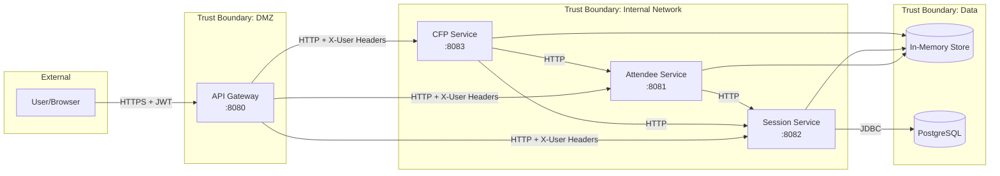
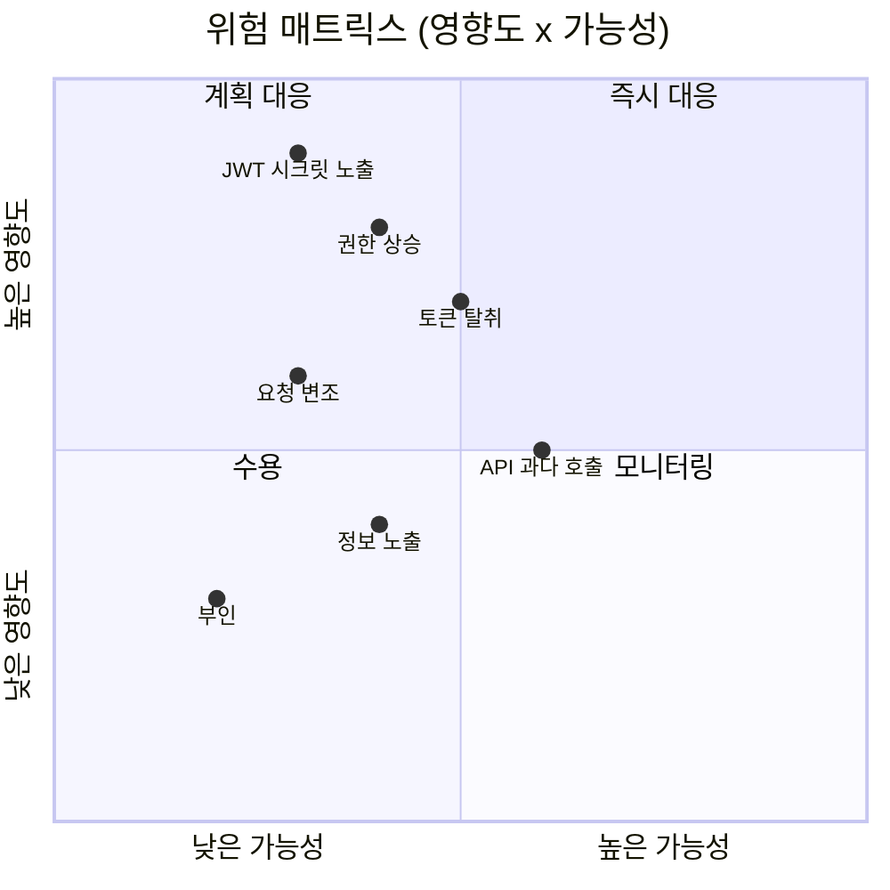

# Threat Model: Conference Management System

## 1. 개요

본 문서는 컨퍼런스 관리 시스템의 위협 모델을 STRIDE 프레임워크로 분석한다.

## 2. Data Flow Diagram (DFD)

## 3. STRIDE 분석

### Spoofing (신원 위장)

| 위협 | 위험도 | 대응 | 상태 |
|------|--------|------|------|
| JWT 토큰 위조 | HIGH | HMAC-SHA256 서명 검증 | 구현됨 |
| JWT 토큰 탈취 | HIGH | HTTPS 필수, 짧은 만료시간 (1h) | 부분 구현 |
| X-User 헤더 직접 조작 | MEDIUM | Gateway만 헤더 주입, 내부 서비스는 Gateway 경유만 허용 | 구현됨 (네트워크 격리 필요) |
| 만료된 토큰 재사용 | MEDIUM | 만료시간 검증 | 구현됨 |

### Tampering (변조)

| 위협 | 위험도 | 대응 | 상태 |
|------|--------|------|------|
| 요청 본문 변조 | HIGH | @Valid 입력 검증, DTO 분리 | 구현됨 |
| 인메모리 데이터 변조 | LOW | 서버 측 ConcurrentHashMap | N/A (데모) |
| 토큰 내용 변조 | HIGH | JWT 서명 검증 | 구현됨 |

### Repudiation (부인)

| 위협 | 위험도 | 대응 | 상태 |
|------|--------|------|------|
| API 호출 부인 | MEDIUM | Gateway LoggingFilter 요청 로깅 | 구현됨 |
| 투표 부인 | LOW | 투표 기록에 attendeeId 포함 | 구현됨 |

### Information Disclosure (정보 노출)

| 위협 | 위험도 | 대응 | 상태 |
|------|--------|------|------|
| 에러 메시지에 내부 정보 노출 | MEDIUM | RFC 7807 ProblemDetail 표준 응답 | 구현됨 |
| 스택 트레이스 노출 | HIGH | GlobalExceptionHandler에서 캐치 | 구현됨 |
| JWT 시크릿 키 노출 | CRITICAL | 하드코딩됨 (데모 한정) | 미해결 (데모) |
| API 응답에 민감 정보 | MEDIUM | DTO 분리로 노출 필드 제어 | 구현됨 |

### Denial of Service (서비스 거부)

| 위협 | 위험도 | 대응 | 상태 |
|------|--------|------|------|
| API 과다 호출 | HIGH | Gateway RateLimitFilter (Token Bucket) | 구현됨 |
| 대용량 요청 본문 | MEDIUM | @Size 검증, Spring 기본 제한 | 부분 구현 |
| Slow HTTP 공격 | MEDIUM | RestClient 타임아웃 (5s/10s) | 구현됨 |

### Elevation of Privilege (권한 상승)

| 위협 | 위험도 | 대응 | 상태 |
|------|--------|------|------|
| ATTENDEE가 ORGANIZER 작업 수행 | HIGH | @RoleRequired + RoleCheckInterceptor | 구현됨 |
| JWT 역할 조작 | HIGH | JWT 서명 검증으로 변조 방지 | 구현됨 |
| 타인 데이터 수정 | MEDIUM | X-User-Id 헤더 기반 소유권 검증 | 부분 구현 |

## 4. 위험 우선순위

## 5. 데모 프로젝트 한계

| 항목 | 프로덕션 요구 | 현재 상태 |
|------|-------------|----------|
| JWT 시크릿 | 환경변수/Vault | 하드코딩 |
| HTTPS | TLS 인증서 | HTTP only |
| 네트워크 격리 | 서비스 메시/VPC | localhost |
| 감사 로그 | 영구 저장 | 콘솔 출력 |
| 세션 관리 | Redis/DB 기반 | Stateless JWT |
