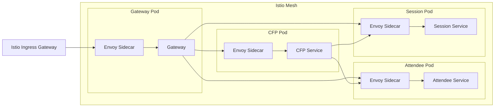

# Service Mesh (Istio) 설정 예시

## 개요

이 디렉토리는 컨퍼런스 관리 시스템에 Istio 서비스 메시를 적용하기 위한 YAML 설정 예시를 포함합니다.

> **참고**: 이 설정은 교육/데모 목적이며, 실제 적용 시에는 환경에 맞게 조정이 필요합니다.

## 파일 목록

| 파일 | 설명 | 관련 책 챕터 |
|------|------|-------------|
| `virtual-service.yaml` | 카나리 배포 트래픽 분배 | Ch5: 서비스 메시 |
| `destination-rule.yaml` | 서킷 브레이커 설정 | Ch5: 서비스 메시 |
| `peer-authentication.yaml` | mTLS 인증 | Ch7: API 보안 |
| `authorization-policy.yaml` | 서비스 간 인가 | Ch7: API 보안 |
| `fault-injection.yaml` | 장애 주입 테스트 | Ch2: 테스트 전략 |

## Istio 설치 (참고)

```bash
# Istio 설치
curl -L https://istio.io/downloadIstio | sh -
istioctl install --set profile=demo

# 네임스페이스 레이블링
kubectl label namespace conference istio-injection=enabled

# 설정 적용
kubectl apply -f docs/service-mesh/
```

## 아키텍처


